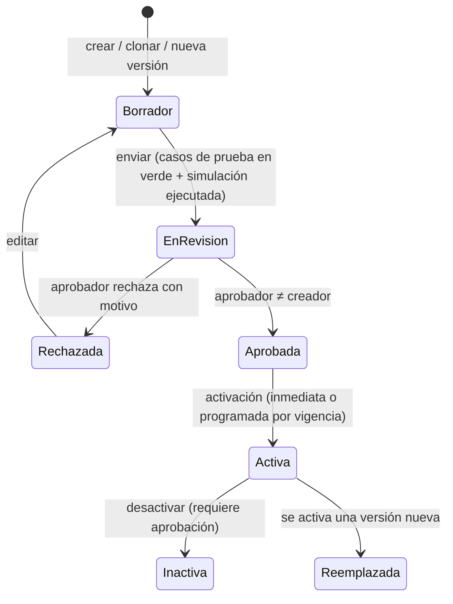

# Anexo B — Motor de reglas no-code
## Garantías 360 — Especificación v0.3

> Detalla M14 (RF-1401 a RF-1408). **Todos los valores numéricos de los ejemplos son ilustrativos**: sirven para mostrar el tipo de regla, no son políticas del Banco. Los valores reales los definen Riesgo de Crédito, Jurídica y Cumplimiento (P-09).

---

## B.1 Modelo de una regla

| Atributo | Descripción |
|---|---|
| Código y nombre | Código único legible (p. ej., `HC-INM`) y nombre de negocio. |
| Descripción | Propósito y norma o política que la sustenta (N-xx o política interna). |
| Tipo | Ver B.2; define las variables de entrada y el tipo de resultado permitido. |
| Alcance | Segmento, producto, tipo de garantía (uno, varios o todos). |
| Vigencia | Desde / hasta. No puede haber dos versiones activas con el mismo alcance y vigencias que se crucen. |
| Condición | Cuándo aplica (expresión booleana o filas de una tabla de decisión). |
| Fórmula / resultado | Expresión o tabla de decisión que produce el resultado. |
| Prioridad | Desempate cuando varias reglas del mismo tipo aplican. Por defecto gana la más específica (más atributos de alcance definidos); después, la de mayor prioridad. |
| Estado | Borrador → En revisión → Aprobada → Activa → Inactiva / Reemplazada; también Rechazada. |
| Versión | Entera y creciente. Cada versión es inmutable una vez enviada a revisión. |
| Creador / aprobador | Usuarios distintos (maker–checker). |
| Casos de prueba | Entradas con resultado esperado; son obligatorios para enviar a revisión. |
| Hash | SHA-256 del contenido de la versión. |

---

## B.2 Tipos de regla

| Tipo | Entradas disponibles (ejemplos) | Resultado |
|---|---|---|
| `HAIRCUT` | tipo de garantía, clase, antigüedad de la valoración, moneda, segmento, estado jurídico | decimal en [0, 1] |
| `IDONEIDAD` | estado jurídico, condicionamientos abiertos, perfeccionamiento, valoración vigente, póliza vigente, tipo, destino del crédito | IDONEA / CONDICIONADA / NO_IDONEA + motivo |
| `COBERTURA_OBJETIVO` | producto, segmento, tipo de garantía, calificación | decimal ≥ 0 |
| `EXPOSICION` | componentes del saldo (capital, intereses, otros) | lista de componentes |
| `PRIORIDAD_GARANTIA` / `PRIORIDAD_OBLIGACION` | tipo, liquidez, idoneidad, fecha de desembolso, prioridad del vínculo | orden |
| `METODO_DISTRIBUCION` / `ASIGNAR_EXCEDENTE` | producto, tipo de garantía | SECUENCIAL / PRORRATA; sí / no |
| `PERIODICIDAD_VALORACION` | tipo, clase, valor, segmento | meses |
| `ALERTA` | cualquier dato de la garantía, la cobertura o la póliza | alerta (código, criticidad, mensaje, responsable) |
| `VALIDACION` | datos de registro | error o advertencia por campo |
| `SLA` | etapa, tipo, segmento | horas o días hábiles |
| `INDICE_SALUD` | componentes del índice | pesos que suman 1 |
| `RECUPERACION` | tipo, mecanismo de ejecución | tasa de recuperación y costos |

---

## B.3 Lenguaje de condiciones y fórmulas

**Propuesta: tablas de decisión DMN con expresiones FEEL**, ejecutadas por un motor DMN embebido en el backend Java (P-20). Por qué:
- Es un estándar (OMG DMN) legible por usuarios de negocio y exportable, que evita quedar atado a un proveedor.
- FEEL cubre aritmética, comparaciones, fechas y duraciones, listas y condicionales, con ejecución segura y sin efectos colaterales.

**Editor no-code:**
- Constructor visual de condiciones: campo → operador → valor, con grupos Y/O.
- Tablas de decisión editables como hoja de cálculo.
- Editor de fórmulas con autocompletado sobre el **catálogo de variables** del tipo de regla y validación de tipos en tiempo real.

**Funciones disponibles (además de las de FEEL):**

| Función | Uso |
|---|---|
| `min`, `max`, `abs`, `sum`, `round(n, escala, modo)` | Aritmética |
| `pct(x)` | Porcentaje → decimal |
| `mesesEntre(f1, f2)`, `diasHasta(f)`, `hoy()` (= fecha de corte) | Antigüedades y vencimientos |
| `trm(moneda, fecha)` | Conversión a COP |
| `tabla(nombre, clave)` | Búsqueda en tablas paramétricas administradas |
| `si(condicion, a, b)`, `coalesce(a, b)` | Condicionales y nulos |

**Restricciones de seguridad:**
- Sin acceso a red, archivos ni base de datos: la regla solo ve las variables que le entrega el motor.
- Límite de tiempo por ejecución.
- Tipos validados al guardar.
- Una regla que falla nunca produce un valor por defecto silencioso (anexo A, A.4).

---

## B.4 Ciclo de vida y gobierno (maker–checker)



- **Crear, editar y clonar**: solo en Borrador.
- **Probar**: ejecuta los casos de prueba de la regla.
- **Simular**: ejecuta la versión candidata sobre el portafolio real a una fecha de corte, **sin afectar producción**, y muestra el impacto frente a la versión activa:
  - garantías que cambian de idoneidad;
  - variación de la cobertura por segmento y producto;
  - alertas nuevas o que desaparecen;
  - obligaciones que caen bajo su objetivo.
- **Aprobar o rechazar**: rol Aprobador de reglas, distinto del creador. La aprobación ve el diff frente a la versión activa, los casos de prueba y el resultado de la simulación.
- **Activar**: publica `ReglaActivada` y dispara el recálculo de las garantías del alcance.
- **Auditoría de ejecución**: cada ejecución registra regla, versión, entradas (hash), resultado, entidad y Correlation ID (RF-1407). Las ejecuciones masivas (recálculo nocturno) se registran por lotes con detalle consultable.

---

## B.5 Ejemplos (contexto colombiano, valores ilustrativos)

**1. Haircut por tipo de garantía** (`HC-TIPO`, tabla de decisión, política de primera coincidencia)

| Tipo de garantía | Moneda = COP | Haircut |
|---|---|---|
| Depósito en garantía (CDT, ahorro) | sí | 0 % |
| Depósito en garantía | no | 10 % |
| Hipoteca de vivienda | — | 30 % |
| Hipoteca no vivienda | — | 40 % |
| Mobiliaria sobre vehículo | — | 40 % |
| Derechos económicos y de cobro | — | 50 % |
| FNG / FAG (sobre el porcentaje certificado) | — | 0 % |
| Pignoración de cesantías FNA | — | 0 % |
| Pagaré / aval | — | 100 % (no aporta valor) |

**2. Haircut adicional por antigüedad de la valoración** (`HC-ANT`)
```
si(mesesEntre(valoracion.fecha, hoy()) > periodicidad.meses,
   min(1, haircutBase + pct(10) * ceiling((mesesEntre(valoracion.fecha, hoy()) - periodicidad.meses) / 12)),
   haircutBase)
```

**3. Idoneidad** (`IDON-GEN`, basada en el Decreto 2555/2010, art. 2.1.2.1.3)
| Condición | Resultado |
|---|---|
| tipo ∈ {PAGARE, AVAL} | NO_IDONEA — "Garantía personal sin valor de realización" |
| estadoJuridico = RECHAZADA | NO_IDONEA — "Concepto jurídico desfavorable" |
| condicionamientosAbiertos > 0 | CONDICIONADA — "Condicionamientos jurídicos pendientes" |
| no perfeccionada | NO_IDONEA — "Garantía no perfeccionada (sin oponibilidad)" |
| valoración vencida | NO_IDONEA — "Valoración vencida" |
| requierePoliza y póliza no vigente | NO_IDONEA — "Póliza obligatoria no vigente (Ley 546/1999)" |
| en otro caso | IDONEA |

**4. Cesantías FNA — destino del crédito** (`IDON-FNA`, prioridad alta)
```
si(garantia.tipo = "CESANTIAS_FNA" and obligacion.destino != "VIVIENDA",
   NO_IDONEA("La pignoración de cesantías solo procede para crédito de vivienda (CST art. 256; Ley 50/1990 art. 104)"),
   continuar)
```
También genera una alerta **crítica** para Jurídica y Cumplimiento (anexo C).

**5. Valor FNG** (`VAL-FNG`)
```
si(certificado.vigenteA(hoy()), obligacion.saldo * pct(certificado.porcentajeCobertura), 0)
```

**6. Cobertura objetivo por producto** (`COB-OBJ`, tabla)
| Producto | Segmento | Cobertura objetivo |
|---|---|---|
| Hipotecario vivienda | Personas | 100 % |
| Libranza | Personas | 100 % |
| Tarjeta de crédito con depósito | Personas | 100 % |
| Capital de trabajo | Banca Empresas | 130 % |

**7. Periodicidad de valoración** (`PER-VAL`)
| Tipo | Meses |
|---|---|
| Mobiliaria sobre vehículo | 12 (Fasecolda anual, decisión D-06) |
| Hipoteca | Según la política de Riesgos (P-09) |
| Derechos de cobro | 6 |
| Cesantías FNA | 12 (tras la consignación anual) |

**8. Alertas de pólizas** (`ALR-POL`)
| Condición | Criticidad |
|---|---|
| diasHasta(poliza.finVigencia) ≤ 30 | ALTA |
| diasHasta(poliza.finVigencia) < 0 | CRITICA |
| poliza.valorAsegurado < garantia.valorComercial × 0,9 | MEDIA (infraseguro) |

**9. Brecha crítica** (`ALR-BRECHA`): `brecha / exposicion > pct(20)` → CRITICA; `> pct(5)` → ALTA.

**10. Pesos del índice de salud** (`IDX-SALUD`): cobertura objetivo 30 %, valoraciones vigentes 20 %, documentación completa 15 %, pólizas vigentes 15 %, perfeccionamiento 10 %, sin alertas críticas 10 %.

**11. SLA de liberación** (`SLA-LIB`): N días hábiles desde la cancelación de la última obligación, según la política del Banco y la normativa de protección al consumidor (P-15).

---

## B.6 Pruebas del motor de reglas

- Cada regla tiene casos de prueba obligatorios; el pipeline ejecuta todos los de las reglas activas.
- Pruebas de solapamiento de vigencias y de resolución por especificidad y prioridad.
- Golden tests: al activar una versión nueva, las versiones anteriores siguen reproduciendo sus resultados históricos.
- Pruebas de seguridad del lenguaje: expresiones maliciosas, bucles, límites de tiempo, tipos inválidos.
