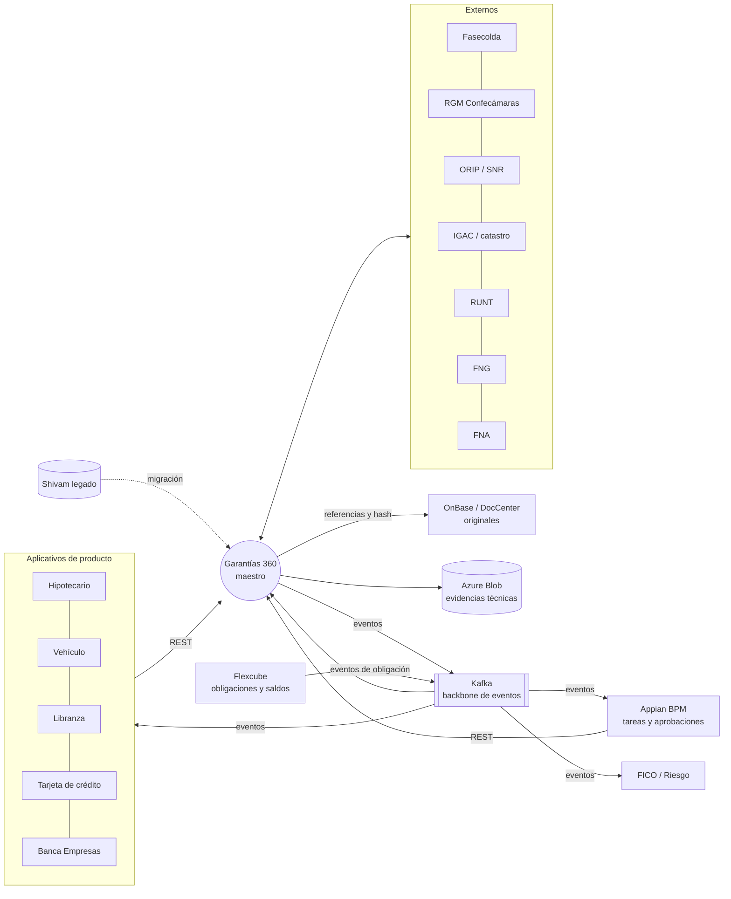
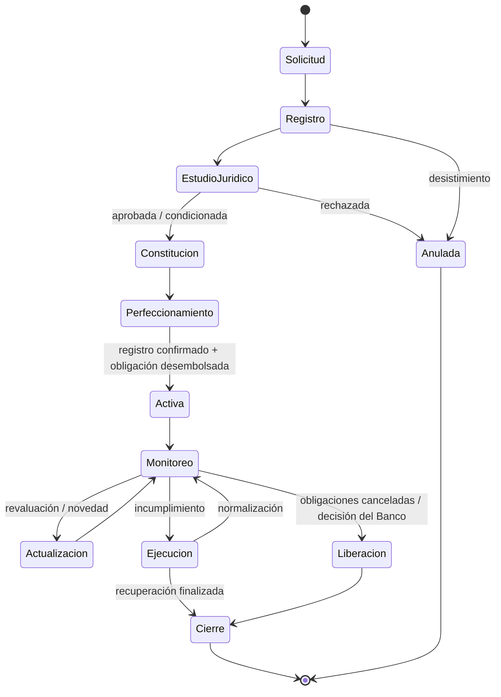

# Especificación funcional y normativa
## Garantías 360 — Banco Popular S.A. (Colombia)

| Campo | Valor |
|---|---|
| Versión | 0.4 — Borrador para validación |
| Fecha | 2026-09-27 |
| Estado | En revisión (Negocio, Riesgo de Crédito, Jurídica, Cumplimiento, Arquitectura TI) |
| Alcance de esta versión | MVP productivo + fases posteriores |
| Anexos | [A — Motor de cobertura](ANEXO_A_MOTOR_COBERTURA.md) · [B — Motor de reglas](ANEXO_B_MOTOR_REGLAS.md) · [C — Garantías sobre cesantías y ahorro en el FNA](ANEXO_C_FNA.md) |

> **Cómo leer este documento.** Cada requisito funcional (RF) lleva identificador, prioridad (**MVP** / **F2** / **F3**) y, cuando aplica, la norma que lo origina (N-xx, sección 3). Todo lo que no fue confirmado por el negocio aparece como **[SUPUESTO]** y se consolida en la sección 16.

---

## 1. Introducción

### 1.1 Objetivo
Construir **Garantías 360**, el **maestro único de garantías** del Banco. Es una plataforma productiva en Azure que controla el ciclo de vida completo del respaldo crediticio, desde la originación hasta la liberación: registro, estudio jurídico, constitución y perfeccionamiento, valoración, cobertura, monitoreo, ejecución y liberación. Reemplaza el sistema actual del proveedor Shivam.

La plataforma debe sostener tres mensajes:
1. **Una sola visión de la garantía.** Toda la información de una garantía y de las obligaciones que respalda está en un único expediente.
2. **Cada cálculo es explicable.** Cobertura, valoración, reglas y alertas muestran de dónde sale cada cifra.
3. **Cada decisión tiene evidencia.** Datos, documentos, reglas, versiones y acciones conservan trazabilidad verificable (SHA-256).

### 1.2 Alcance
**Garantías y productos incluidos:** libranzas, tarjetas de crédito, Banca Empresas, créditos con respaldo del FNA (anexo C), garantías FNG, garantías inmobiliarias, vehiculares, depósitos en garantía, derechos económicos y de cobro, garantías mobiliarias, fiducias en garantía, y cualquier tipo nuevo que el negocio configure sin desarrollo (M16).

**Excluido:**
- Garantías que el Banco **otorga** a terceros (garantías bancarias / stand-by).
- Originación y aprobación del crédito (aplicativos de producto).
- Workflow y bandejas de tareas humanas (**Appian**, D-16).
- Datos financieros de la obligación (**Flexcube**).
- Custodia de documentos originales (**OnBase / DocCenter**, D-18).
- Decisión y cálculo final de riesgo (**FICO**, D-19).
- Contabilidad general.

### 1.3 Glosario
| Término | Definición |
|---|---|
| Garantía | Bien, derecho o compromiso de un tercero que respalda una o varias obligaciones del deudor con el Banco. |
| Garantía idónea / admisible | Garantía que cumple el art. 2.1.2.1.3 del Decreto 2555/2010: valor establecido con criterios técnicos y objetivos, suficiente, jurídicamente eficaz y con posibilidad real de realización. En este documento *idónea* = *admisible*. |
| Garantía condicionada | Garantía con concepto jurídico favorable sujeto a condicionamientos pendientes. No es idónea hasta que se cumplan. |
| Valor comercial | Valor de mercado de la última valoración vigente. |
| Valor técnico | Valor determinado por el perito según la metodología (p. ej., valor de reposición o de realización). |
| Haircut | Descuento porcentual que refleja riesgo de realización, liquidez, antigüedad del avalúo o moneda. Lo define una regla (anexo B). |
| Valor admisible | Valor bruto × (1 − haircut). |
| Valor neto | Valor admisible − gravámenes de mayor prelación − valor comprometido con otros acreedores. Es el valor distribuible entre obligaciones. |
| Exposición | Saldo de la obligación que se considera para cubrir (componentes configurables: capital, intereses, otros). Proviene de Flexcube. |
| Cobertura objetivo / real | Cobertura exigida por política (regla) frente a la obtenida (valor asignado ÷ exposición). |
| Descubierto | Parte de la exposición sin cubrir: max(0, exposición − valor asignado). |
| Brecha de cobertura | max(0, exposición × cobertura objetivo − valor asignado). |
| Perfeccionamiento | Cumplimiento de las formalidades legales para que la garantía sea oponible a terceros. |
| Correlation ID | Identificador que acompaña una operación de negocio a través de todos los sistemas, eventos y registros. |
| Maker–checker | Doble control: quien crea o modifica no puede aprobar. |
| NPN | Número Predial Nacional (catastro). |
| RGM | Registro de Garantías Mobiliarias (Ley 1676/2013), administrado por Confecámaras. |

---

## 2. Principio de arquitectura funcional

**Garantías 360 es el maestro de garantías y no sustituye a los sistemas especializados.**

| Sistema | Responsabilidad | Relación con Garantías 360 |
|---|---|---|
| **Garantías 360** | Maestro de garantías, relaciones garantía–obligación, estados, valoraciones, asignaciones, cobertura, reglas, eventos, evidencias y auditoría. | Fuente oficial de la garantía. |
| **Appian (BPM)** | Experiencia de procesos: tareas humanas, bandejas, aprobaciones y SLA de tareas. | Orquesta las tareas y **llama a las APIs de Garantías 360** para leer y escribir. Garantías 360 valida cada transición y cada regla. Los eventos de Garantías 360 inician o avanzan los procesos de Appian. |
| **Flexcube** | Obligación financiera: saldo, mora, estado y datos del crédito. | Garantías 360 consume eventos o consultas de obligaciones y saldos, y **nunca los modifica**. |
| **OnBase / DocCenter** | Custodia de documentos originales. | Garantías 360 guarda la referencia al documento en OnBase, sus metadatos y su **hash SHA-256**. |
| **Azure Blob Storage (privado)** | Evidencias técnicas propias de Garantías 360. | Snapshots de cálculos, exportes, paquetes de evidencia y bitácoras con inmutabilidad (WORM). |
| **FICO / Riesgo** | Decisión de crédito y cálculo final de riesgo (PDI, pérdida esperada). | Consume de Garantías 360 la cobertura, el valor admisible, la idoneidad y el tipo de garantía. |
| **Aplicativos de producto** (hipotecario, vehículo, libranza, tarjeta de crédito, Banca Empresas…) | Flujo comercial de la solicitud. | Registran la garantía por API y consultan su estado y valores. |
| **Externos** | Fasecolda, RGM (Confecámaras), ORIP/SNR, IGAC y gestores catastrales, RUNT, FNG, FNA, avaluadores, aseguradoras. | Integraciones propias de Garantías 360 (M20). |

**Reglas de frontera:**
- **R-01.** Un proceso de Appian no cambia el estado de una garantía directamente en base de datos. Siempre invoca una API de Garantías 360, que valida la transición y la registra en la auditoría.
- **R-02.** Garantías 360 no guarda saldos como dato propio. Guarda la **copia fechada** del saldo usado en cada cálculo de cobertura (para reproducirlo) y concilia a diario con Flexcube.
- **R-03.** Garantías 360 no custodia originales. Un documento está "completo" cuando existe en OnBase y su hash coincide.
- **R-04.** La configuración propia de Garantías 360 (tipos de garantía, reglas, controles) tiene su maestro y su maker–checker **dentro de Garantías 360**, porque es gobierno del maestro y no proceso de negocio. **[SUPUESTO — validar con Appian]**

---

## 3. Marco normativo

**Jurídica, Riesgos y Cumplimiento deben validar vigencia y alcance antes de aprobar.** Las normas se vuelven controles verificables en el módulo de Cumplimiento SFC (M13).

| # | Norma | Qué exige a la plataforma | Módulos |
|---|---|---|---|
| N-01 | **Decreto 2555 de 2010**, art. 2.1.2.1.3 y ss. (garantías idóneas/admisibles) | Evaluar y conservar la idoneidad de cada garantía con criterios parametrizables: valor técnico y objetivo, eficacia jurídica, posibilidad de realización. | M04, M05, M08, M14 |
| N-02 | **Circular Básica Contable y Financiera (CE 100/1995)** — Cap. XXXI (SIAR), anexo de riesgo de crédito y modelos de referencia de cartera | Información de garantías completa, actualizada y trazable; valor y su actualización periódica; tipo de garantía como insumo de la PDI; políticas de valoración, seguimiento y realización. | M07, M08, M10, M13 |
| N-03 | **Ley 1676 de 2013** y **Decreto 1835 de 2015** (DUR 1074 de 2015) — Garantías mobiliarias | Inscripción, modificación, prórroga, cancelación y ejecución en el RGM; folio electrónico; cancelación al extinguirse la obligación. Cubre también **derechos económicos y de cobro** y sus mecanismos de ejecución (pago directo, ejecución especial). | M06, M11, M12, M20 |
| N-04 | **Ley 1579 de 2012** (Estatuto de Registro de Instrumentos Públicos) | Hipotecas: escritura registrada en la ORIP, matrícula inmobiliaria, anotación de la hipoteca y de su cancelación, certificado de tradición. | M06, M12 |
| N-05 | **Ley 1673 de 2013**, **Decreto 556 de 2014** y **Resolución IGAC 620 de 2008** | Avaluador con RAA vigente, informe de avalúo conservado, metodología identificada. | M07 |
| N-06 | **Ley 546 de 1999** y normas de **seguros asociados a créditos hipotecarios** (Decreto 2555/2010, Libro 36, Tít. 2, Cap. 2; Decreto 673/2014) | Seguros de incendio y terremoto vigentes sobre inmuebles hipotecados, con el Banco como beneficiario oneroso. | M18 |
| N-07 | **Guía de Valores Fasecolda** | Revaluación anual de vehículos. | M07 |
| N-08 | **Circular Básica Jurídica (CE 029/2014), Parte I, Tít. IV, Cap. IV — SARLAFT** | Consulta en listas de propietarios y garantes no clientes, con evidencia. | M04 |
| N-09 | **CBCF Cap. XXXI (SIAR) — riesgo operacional** y **CBJ Parte I, Tít. IV, Cap. V — ciberseguridad** | Trazabilidad, doble control, segregación de funciones, gestión de incidentes, continuidad. | M14, M15, M24 |
| N-10 | **CE 005 de 2019 SFC** (computación en la nube) | Condiciones para operar en Azure: ubicación y cifrado de datos, acceso de la SFC, plan de salida y continuidad. Aplica también al modelo de IA del Asistente (M02). | RNF, §12 |
| N-11 | **Ley 1581 de 2012**, Decreto 1377 de 2013; **Ley 1266 de 2008** | Finalidad, minimización, seguridad y derechos del titular sobre datos de deudores, propietarios y garantes. Solo datos sintéticos en ambientes no productivos. | M04, M02, M24, §15 |
| N-12 | **Ley 1328 de 2009** (consumidor financiero) | Liberación oportuna, paz y salvo y entrega de documentos al extinguirse la obligación. | M12 |
| N-13 | **Código de Comercio, art. 60**; **Ley 962 de 2005, art. 28** | Conservación por **10 años**. | M15, M19 |
| N-14 | **Ley 527 de 1999**; **Decreto 2364 de 2012** | Validez de documentos electrónicos, firma electrónica e integridad (hash) de las evidencias. | M15, M19 |
| N-15 | **CUIF** (cuentas de orden de garantías recibidas); **NIIF 9** | Insumos contables y de pérdida esperada. | M22 |
| N-16 | **Ley 1527 de 2012** (libranza) | Identificación de la libranza y del pagador en garantías de ese producto. | M04 |
| N-17 | Reglamentos del **FNG** y del **FAG** | Certificado, porcentaje de cobertura, vigencia, comisión y reclamación de la garantía. | M06, M08, M11 |
| N-18 | **Ley 14 de 1983**; **Ley 1955 de 2019, arts. 79-82**; reglamentación técnica del **IGAC** | Avalúo catastral de inmuebles en garantía (NPN, vigencia, gestor catastral) y su reporte al IGAC o al gestor catastral. | M07, M20 |
| N-19 | **Código Sustantivo del Trabajo, art. 256**, y **Ley 50 de 1990, art. 104** (pignoración de cesantías) | La pignoración de cesantías solo procede con **autorización escrita del trabajador** y para **créditos de vivienda**. Ver anexo C. | M05, M14, anexo C |
| N-20 | **Ley 432 de 1998** (FNA) y el **reglamento de cesantías vigente del FNA** (Acuerdos de Junta Directiva) | Pignoración de cesantías a favor de entidades autorizadas por ley, siempre que no exista una pignoración vigente con el FNA; envío al FNA de la copia de la libranza o del pagaré; efectividad al retiro definitivo. Ver anexo C. | M06, M12, M20 |
| N-21 | **Ley 769 de 2002** (Código Nacional de Tránsito) y **RUNT** | Anotación de la garantía o prenda en el registro del vehículo y su levantamiento. **[Validar con Jurídica la articulación con la inscripción en el RGM.]** | M06, M12 |
| N-22 | **Decreto 1297 de 2022** (finanzas abiertas) y reglamentación de la SFC | Principio de diseño para las APIs: contratos estándar, versionados, seguros y documentados. Las APIs de Garantías 360 son internas, así que no aplica como obligación de intercambio con terceros. | §11 |
| N-23 | **Política nacional de inteligencia artificial** (CONPES vigente) y principios de la SFC sobre uso de IA **[validar vigencia]** | IA explicable, auditable, con supervisión humana y sin decisiones automatizadas de crédito. | M02 |

---

## 4. Actores, roles y segregación de funciones

La autorización se compone de **área funcional × nivel**. Los niveles son los que definió el negocio: Administrador, Gestor, Director y Consultor.

| Área \ Nivel | Consultor (lectura) | Gestor (registra y opera) | Director (aprueba) |
|---|---|---|---|
| **Operaciones** | Consulta garantías y expedientes | Registro, constitución, valoraciones, pólizas, liberación | Aprueba liberaciones, sustituciones y cambios de valor sobre el umbral |
| **Jurídica** | Consulta estudios | Estudio jurídico, conceptos, hallazgos, condicionamientos | Aprueba el concepto jurídico final y el inicio de la ejecución |
| **Riesgos** | Cobertura y tableros | Simula cobertura y propone reglas | Aprueba reglas (**Aprobador de reglas**) |
| **Comercial** | Garantías de sus clientes (alcance restringido) | — | — |
| **Cumplimiento** | Controles SFC y auditoría | Gestiona brechas y planes de remediación | Aprueba el cierre de brechas |
| **Auditor** | **Lectura total**, incluida la auditoría y las evidencias; sin permisos de escritura | — | — |
| **Administrador funcional** | — | Configura tipos de garantía, catálogos, controles y parámetros | Aprueba la publicación de configuración hecha por otro administrador |

**Segregación de funciones (obligatoria):**
- Quien crea o modifica no aprueba (reglas, configuración, liberación, cambios de valor, ejecución).
- El Administrador funcional no opera garantías.
- El Auditor no escribe.
- Los permisos se aplican **en la API** de Garantías 360, no solo en la interfaz ni en Appian.
- Los roles vienen de grupos de Microsoft Entra ID, con alcance de datos por segmento, regional, producto o cartera asignada.

**Clientes técnicos:** aplicativos de producto, Appian, FICO y procesos batch, cada uno con credenciales propias y permisos mínimos.

---

## 5. Mapa de módulos (navegación)

| Menú | Módulo | Prioridad |
|---|---|---|
| **Operación** | M01 Resumen — Centro de mando de riesgo crediticio | MVP |
| | M02 Asistente IA / Copiloto de garantías | F2 |
| | M03 Ciclo de vida | MVP |
| | M04 Garantías (registro maestro + Expediente 360) | MVP |
| | M05 Estudio jurídico | MVP |
| | M06 Constitución y registro | MVP |
| | M07 Valoraciones | MVP |
| | M08 Cobertura | MVP |
| | M09 Core transaccional | MVP |
| | M10 Monitoreo | MVP |
| | M11 Ejecución | MVP (básico) / F2 |
| | M12 Liberación | MVP |
| **Gobierno** | M13 Cumplimiento SFC | MVP (controles e indicadores) / F2 (remediación) |
| | M14 Reglas | MVP |
| | M15 Auditoría | MVP |
| **Administración** | M16 Configuración de tipos de garantía | MVP |
| | M17 Registro por API y carga masiva | MVP |
| | M18 Seguros | MVP |
| | M19 Documentos y evidencias | MVP |
| | M20 Integraciones externas | MVP (manual + archivo) / F2 (automáticas) |
| | M21 Eventos Kafka | MVP |
| | M22 Reportes | MVP |
| | M23 Migración Shivam | MVP |
| | M24 Seguridad y administración | MVP |

La interfaz tiene barra lateral con estos grupos, encabezado con buscador global (ID de garantía, cliente, obligación, matrícula, placa), migas de pan, tarjetas de indicadores, tablas avanzadas con filtros y exportación, gráficas, líneas de tiempo, estados con color, alertas, paneles laterales y modales. Todos los módulos comparten el mismo sistema de diseño, basado en el **manual de marca oficial de Banco Popular** (P-19).

---

## 6. Requisitos funcionales

### M01 — Resumen: Centro de mando de riesgo crediticio

Mensaje principal: *"Control integral del respaldo, desde la originación hasta la liberación."*
Mensaje complementario: *"Una vista única para anticipar brechas, explicar cada cálculo y tomar decisiones con evidencia verificable."*

| ID | Requisito | Prioridad |
|---|---|---|
| RF-0101 | Tablero con los indicadores de la tabla siguiente, filtrables por segmento, producto, tipo de garantía, regional y fecha de corte. | MVP |
| RF-0102 | Cada indicador es **explicable**: al hacer clic muestra su fórmula, la fecha de corte, la versión de la regla o fórmula y el listado de garantías que lo componen. | MVP |
| RF-0103 | Evolución de la cobertura de los últimos 12 meses (a partir de los cálculos versionados de M08) y composición del respaldo por tipo de garantía y segmento. | MVP |
| RF-0104 | Lista de "Casos que requieren atención", priorizada por criticidad (desde M10). | MVP |

| Indicador | Fórmula propuesta **[validar con Riesgos]** |
|---|---|
| Valor total de garantías | Σ valor comercial vigente de las garantías activas (COP, con la TRM de la fecha de corte) |
| Garantías activas | Conteo de garantías en los macroestados *Activa*, *En monitoreo* o *En ejecución* |
| Exposición cubierta | Σ valor asignado ÷ Σ exposición de las obligaciones con garantía |
| Cobertura idónea | Σ valor asignado de garantías idóneas ÷ Σ exposición |
| Garantías condicionadas / no idóneas | Conteo y valor por resultado de idoneidad (M14) |
| Valoraciones próximas a vencer | Conteo con próxima valoración ≤ N días (parámetro; por defecto 30) |
| Brechas críticas | Conteo de obligaciones con brecha de cobertura > umbral crítico (regla) |
| Cumplimiento normativo | Nivel ponderado de cumplimiento de los controles de M13 |
| Alertas | Alertas abiertas por criticidad (M10) |
| **Índice de salud del portafolio** | Promedio ponderado (0–100) de: % de obligaciones que alcanzan su cobertura objetivo, % de valoraciones vigentes, % de documentación completa, % de pólizas vigentes, % de garantías perfeccionadas y % sin alertas críticas. Los pesos se definen en una regla versionada (M14). |

### M02 — Asistente IA / Copiloto de garantías (F2)

**Principio crítico:** la IA **no ejecuta decisiones crediticias ni modifica garantías**. Consulta, resume, explica, identifica evidencias, cita fuentes, facilita la navegación y recomienda acciones para revisión humana.

| ID | Requisito | Prioridad | Norma |
|---|---|---|---|
| RF-0201 | Preguntas en lenguaje natural sobre garantías, coberturas, valoraciones, documentos, reglas y alertas. Ejemplos: *"¿Por qué esta garantía tiene 86 % de cobertura?"*, *"¿Qué avalúos vencen en 30 días?"*. | F2 | — |
| RF-0202 | **Solo lectura:** el asistente usa exclusivamente las APIs de consulta de Garantías 360, **con los permisos del usuario que pregunta** (token en nombre del usuario). No ve más que el usuario. | F2 | N-09, N-11 |
| RF-0203 | Cada respuesta **cita sus fuentes**: garantía, cálculo y versión, regla y versión, documento y hash, con enlace. Si no hay fuente, responde que no sabe. | F2 | N-23 |
| RF-0204 | Las explicaciones de cobertura se generan a partir de la **traza del cálculo** (anexo A), no se infieren. | F2 | — |
| RF-0205 | Las recomendaciones se presentan como sugerencias con un botón que lleva a la acción en Appian o Garantías 360. Nunca se ejecutan solas. | F2 | N-23 |
| RF-0206 | Auditoría de cada interacción: usuario, pregunta, fuentes consultadas, respuesta, modelo y versión, Correlation ID. | F2 | N-09 |
| RF-0207 | El modelo se despliega en el tenant de Azure del Banco (región aprobada), sin uso de los datos para entrenamiento, con protección contra instrucciones incrustadas en documentos (los documentos se tratan como datos) y con minimización de datos personales. | F2 | N-10, N-11 |
| RF-0208 | Un conjunto de evaluación versionado (preguntas con respuestas esperadas) se ejecuta antes de cada cambio de modelo o de prompt. | F2 | N-23 |

### M03 — Ciclo de vida

**Macroestados fijos** (comunes a todos los tipos; cada tipo mapea sus estados configurables a ellos, ver M16):

| ID | Requisito | Prioridad | Norma |
|---|---|---|---|
| RF-0301 | Visualización gráfica del ciclo de vida de cada garantía: etapa actual, etapas completadas, responsable, SLA (cumplido, en riesgo, vencido), fechas, documentos y eventos de cada etapa. | MVP | N-02 |
| RF-0302 | Toda transición se hace por **API de Garantías 360** (invocada por Appian, por un aplicativo o por un usuario autorizado). Se valida contra el flujo del tipo y sus reglas, y deja: actor, fecha y hora, motivo, evidencia, aprobador (si aplica) y Correlation ID. | MVP | N-09 |
| RF-0303 | Los **responsables y SLA de tareas** se sincronizan desde Appian por evento. La vista enlaza a la tarea en Appian. | MVP | — |
| RF-0304 | Transiciones automáticas por eventos: desembolso (Flexcube) → *Activa*; cancelación total de obligaciones → inicia *Liberación*; mora > umbral (regla) → alerta y propuesta de *Ejecución* (no automática). | MVP | N-12 |
| RF-0305 | Vista de ciclo de vida del portafolio: embudo por etapa, tiempos promedio y garantías con SLA vencido. | MVP | — |

### M04 — Garantías: registro maestro y Expediente 360

| ID | Requisito | Prioridad | Norma |
|---|---|---|---|
| RF-0401 | Cada garantía tiene un **UUID técnico** y un **identificador de negocio** con formato `GAR-AAAA-NNNNNN` (p. ej., GAR-2026-004901), consecutivo por año, inmutable. | MVP | — |
| RF-0402 | **Campos mínimos del maestro:** tipo de garantía; cliente e identificación; obligación(es) asociada(s); producto; segmento; estado (macroestado + estado del tipo); fechas de creación, constitución y perfeccionamiento; vigencia; valor comercial; valor admisible; valor neto; cobertura; moneda; avalúo vigente; pólizas; documentos; propietarios; beneficiarios; obligaciones relacionadas; fuente de información (API de producto, carga masiva, migración Shivam, manual); **estado jurídico** (sin estudio, en estudio, con observaciones, condicionada, aprobada, rechazada); **estado documental** (completo, incompleto, con documentos vencidos); fecha de la próxima valoración; idoneidad (idónea, condicionada, no idónea) con la regla y la versión que la determinaron. | MVP | N-01, N-02 |
| RF-0403 | Relación **N:M garantía–obligación**: una garantía respalda varias obligaciones y una obligación tiene varias garantías. Cada vínculo tiene tipo (cerrada/específica o abierta), tope, prioridad, porcentaje o valor pactado (opcional) y vigencia. | MVP | N-02 |
| RF-0404 | Garantías **compartidas** con otros acreedores o con grados de hipoteca: se registra el acreedor, el grado o prelación y el valor comprometido, que se descuenta en el valor neto. | MVP | N-02 |
| RF-0405 | **Participantes:** propietarios o constituyentes, garantes, deudores y beneficiarios, con porcentaje de propiedad. Consulta SARLAFT de los no clientes por el servicio de listas del Banco, con evidencia. | MVP (datos) / F2 (SARLAFT) | N-08, N-11 |
| RF-0406 | Detección de duplicados por llave natural configurable por tipo (matrícula inmobiliaria, placa + VIN, número de CDT, certificado FNG, contrato de derechos de cobro, identificación del afiliado en el FNA). | MVP | N-02 |
| RF-0407 | Búsqueda avanzada y listado con filtros combinables, columnas configurables, exportación (respetando permisos) y vistas guardadas. | MVP | — |
| RF-0408 | **Expediente 360:** página por garantía, con pestañas: Resumen · Cliente y participantes · Obligaciones · Cobertura · Valoraciones · Documentos · Seguros · Jurídico (estudio, constitución, registros) · Eventos · Alertas · Reglas ejecutadas · Auditoría · Histórico (versiones del maestro) · Evidencias. | MVP | N-02, N-09 |
| RF-0409 | **Vista 360 por obligación y por cliente:** todas las garantías que respaldan una obligación o a un cliente, con su cobertura consolidada. | MVP | N-02 |
| RF-0410 | Versionamiento del registro maestro: cada cambio crea una versión consultable ("cómo estaba la garantía el día X"). | MVP | N-09 |

### M05 — Estudio jurídico

| ID | Requisito | Prioridad | Norma |
|---|---|---|---|
| RF-0501 | Estudio jurídico por garantía con: tipo, cliente, documentación analizada, **checklist jurídico por tipo** (configurable en M16), resultado, observaciones, concepto jurídico, hallazgos, condicionamientos, responsable, fechas y evidencias. | MVP | N-01, N-03, N-04 |
| RF-0502 | Estados: **Pendiente → En estudio → Con observaciones ↔ En estudio → Aprobada / Aprobada con condicionamientos / Rechazada**. La tarea se ejecuta en Appian; Garantías 360 guarda el contenido y valida la transición. | MVP | — |
| RF-0503 | **Hallazgos** con severidad (crítico, mayor, menor) y **condicionamientos** con descripción, responsable, fecha límite y evidencia de cumplimiento. Mientras haya condicionamientos abiertos, la garantía es *condicionada* y no idónea (regla). | MVP | N-01 |
| RF-0504 | Ejemplos de checklist: **inmueble** — títulos a 10 años o más, certificado de tradición reciente, limitaciones al dominio, afectación a vivienda familiar o patrimonio de familia, embargos; **vehículo** — historial en el RUNT, prendas previas, comparendos; **derechos de cobro** — contrato fuente, cesibilidad, notificación al deudor cedido; **cesantías FNA** — autorización escrita del trabajador, destino de vivienda, ausencia de pignoración vigente con el FNA (anexo C). | MVP | N-19, N-20 |
| RF-0505 | El concepto jurídico aprobado exige una aprobación de nivel Director de Jurídica distinto de quien elaboró el estudio. | MVP | N-09 |
| RF-0506 | Tablero de estudios por estado, abogado, antigüedad y SLA. | MVP | — |

### M06 — Constitución y registro

| ID | Requisito | Prioridad | Norma |
|---|---|---|---|
| RF-0601 | Cada tipo de garantía tiene una **plantilla de actividades de perfeccionamiento** configurable (M16). Al aprobarse el estudio jurídico se genera el plan de actividades de la garantía. | MVP | N-03, N-04 |
| RF-0602 | Cada actividad tiene responsable, fecha límite, estado (pendiente, en curso, completada, bloqueada, no aplica), evidencia (referencia a OnBase + hash) y datos específicos (número de escritura, notaría, radicado, folio, etc.). | MVP | N-14 |
| RF-0603 | Actividades del catálogo inicial: firma de documentos; escritura pública; pago de derechos de registro y boleta fiscal; radicación y registro en la ORIP; inscripción en el RGM (formulario inicial); anotación en el organismo de tránsito o RUNT; inscripción en la Cámara de Comercio cuando aplique; confirmación o expedición del certificado FNG; confirmación de la pignoración por el FNA; constitución o endoso de pólizas; notificación al deudor cedido (derechos de cobro); constitución del contrato de fiducia y certificado de garantía. | MVP | N-03, N-04, N-17, N-20, N-21 |
| RF-0604 | La garantía pasa a *Perfeccionamiento completado* solo con todas las actividades obligatorias completadas y con evidencia. | MVP | N-01 |
| RF-0605 | Las tareas humanas se ejecutan en Appian. Garantías 360 expone el plan, recibe el avance por API y publica `GarantiaPerfeccionada`. | MVP | — |

### M07 — Valoraciones

| ID | Requisito | Prioridad | Norma |
|---|---|---|---|
| RF-0701 | Registro de valoraciones con: valor comercial, valor técnico, fecha, perito o proveedor (con RAA si es avalúo), metodología, vigencia, **haircut aplicado (con la regla y la versión)**, valor admisible, valor neto y próxima fecha de valoración. | MVP | N-02, N-05 |
| RF-0702 | **Histórico completo e inmutable** de valoraciones. Una corrección crea una nueva versión con motivo, nunca sobrescribe. | MVP | N-09 |
| RF-0703 | Tipos de valoración: avalúo comercial, avalúo catastral, guía Fasecolda, índice, saldo certificado (depósitos, cesantías FNA), porcentaje de cobertura certificado (FNG/FAG), valor del contrato o de la cartera cedida (derechos de cobro) y valor de los derechos fiduciarios. | MVP | N-02 |
| RF-0704 | **Revaluación anual de vehículos con Fasecolda**: carga de la guía, cruce por código y modelo, traza del resultado y bandeja para los vehículos sin coincidencia. | MVP | N-07 |
| RF-0705 | **Avalúo catastral de inmuebles**: NPN, gestor catastral, valor y vigencia, con histórico separado del avalúo comercial. Alerta de inmuebles sin avalúo catastral de la vigencia actual. | MVP | N-18 |
| RF-0706 | Actualización del valor de inmuebles por índice o por nuevo avalúo, según la periodicidad que definan las reglas. | F2 | N-02 |
| RF-0707 | Alertas de valoraciones vencidas y próximas a vencer (30/60/90 días, configurable). | MVP | N-02 |
| RF-0708 | Un cambio de valoración dispara un **recálculo de cobertura** (M08) y publica `GarantiaValorada`. | MVP | — |
| RF-0709 | Cambio manual de valor por encima del umbral → aprobación maker–checker (Appian). | MVP | N-09 |

### M08 — Cobertura

Especificación detallada del algoritmo, casos límite y casos de prueba: **[Anexo A](ANEXO_A_MOTOR_COBERTURA.md)**.

| ID | Requisito | Prioridad | Norma |
|---|---|---|---|
| RF-0801 | Cálculo de cobertura por **obligación, garantía, cliente y portafolio**, mostrando: exposición, garantías asociadas, valor bruto, haircut, valor admisible, valor neto, valor utilizado, valor disponible, cobertura objetivo, cobertura real, descubierto, brecha y ratio de cobertura. | MVP | N-02 |
| RF-0802 | Contempla: una garantía con varias obligaciones, varias garantías para una obligación, límites (topes de garantías abiertas, porcentaje FNG, cupo pactado), **priorización**, **métodos de distribución** (secuencial por prioridad, prorrata, valor pactado), redondeos, garantías compartidas, valores cero, valores inválidos, y coberturas de 0 % a 100 % y superiores al 100 %. | MVP | N-02 |
| RF-0803 | **Explicabilidad total:** cada cifra abre su traza, paso a paso, con entradas, regla y versión, fórmula y resultado. | MVP | N-02 |
| RF-0804 | **Versionamiento del cálculo:** cada ejecución guarda la fecha de corte, el disparador (evento o Correlation ID), las entradas (con su hash), las versiones de reglas, las salidas y la traza. Se puede reproducir un cálculo pasado y obtener el mismo resultado. | MVP | N-09, N-14 |
| RF-0805 | Recálculo automático por eventos (nueva valoración, cambio de saldo en Flexcube, vínculo o desvínculo, cambio de estado o idoneidad, activación de una regla) y recálculo nocturno completo con fecha de corte. | MVP | — |
| RF-0806 | **Simulación:** recalcular con valores o reglas hipotéticos sin afectar el cálculo oficial (usada por M14 y por Riesgos). | MVP | — |
| RF-0807 | Publicación de `CoberturaCalculada` para FICO y los aplicativos de producto. | MVP | — |

### M09 — Core transaccional de garantías

| ID | Requisito | Prioridad |
|---|---|---|
| RF-0901 | Vista del registro operacional central: eventos recibidos y procesados, obligaciones, garantías y relaciones garantía–obligación, con estado de procesamiento, fecha y hora, sistema origen, Correlation ID, versión del evento y estado técnico (recibido, procesado, duplicado descartado, en reintento, en DLQ, reprocesado). | MVP |
| RF-0902 | **Linaje:** desde un evento de negocio se navega a todos los registros que generó o modificó (entidad, id, versión) y a los eventos que publicó. También en sentido inverso: desde un registro, al evento que lo originó. | MVP |
| RF-0903 | Búsqueda por Correlation ID con la **línea de tiempo de extremo a extremo** a través de aplicativo, Appian, Garantías 360, Kafka, Flexcube y FICO. | MVP |
| RF-0904 | Reprocesamiento controlado de eventos en DLQ (rol técnico con aprobación), con auditoría. | MVP |

### M10 — Monitoreo

| ID | Requisito | Prioridad | Norma |
|---|---|---|---|
| RF-1001 | Centro de monitoreo funcional: garantías vencidas, avalúos por vencer, pólizas próximas a vencer, documentos faltantes, cambios de cobertura relevantes, incumplimientos de reglas, SLA vencidos. | MVP | N-02, N-06 |
| RF-1002 | Monitoreo técnico: eventos fallidos, integraciones pendientes, retraso de consumo en Kafka (*lag*), errores de API. | MVP | N-09 |
| RF-1003 | **Conciliación entre sistemas:** diaria con Flexcube (obligaciones existentes, estado y saldo), con OnBase (documentos referenciados existen y su hash coincide) y con Appian (tareas huérfanas o garantías sin proceso). Cada diferencia genera una alerta. | MVP | N-02, N-09 |
| RF-1004 | Las alertas se generan por reglas (M14), con criticidad (crítica, alta, media, baja), responsable, SLA y estado (abierta, en gestión, resuelta, descartada con motivo). Se priorizan y filtran por criticidad. | MVP | — |
| RF-1005 | Cada alerta crea o actualiza una tarea en Appian vía `AlertaGenerada`. | MVP | — |

### M11 — Ejecución

| ID | Requisito | Prioridad | Norma |
|---|---|---|---|
| RF-1101 | Registro de las garantías en ejecución: obligación, cliente, saldo (Flexcube), garantía, valor, cobertura, estado jurídico, **mecanismo** (judicial, pago directo o ejecución especial según la Ley 1676, reclamación FNG/FAG, cobro de cesantías pignoradas al FNA, restitución fiduciaria), etapa, recuperación estimada, recuperación obtenida, fechas, responsable (abogado interno o externo), juzgado o radicado y evidencias. | MVP (registro) | N-03, N-17, N-20 |
| RF-1102 | Recuperación estimada = valor neto × tasa de recuperación por tipo − costos estimados (regla). Se compara con la obtenida. | F2 | N-02 |
| RF-1103 | Registro de costos, bienes recibidos en dación o adjudicación, y cierre con su resultado. | F2 | — |
| RF-1104 | El inicio de la ejecución requiere aprobación de un Director de Jurídica (Appian) y publica un evento. | MVP | N-09 |

### M12 — Liberación

| ID | Requisito | Prioridad | Norma |
|---|---|---|---|
| RF-1201 | Flujo de liberación: solicitud (automática por cancelación de obligaciones o manual por decisión del Banco) → validaciones → autorizaciones → paz y salvo → cancelación de registros → entrega de documentos → estado final, todo con evidencia. | MVP | N-12 |
| RF-1202 | **Bloqueo:** no se libera una garantía con obligaciones activas en Flexcube (consulta en línea al momento de liberar), ni una garantía compartida o abierta que respalde otras obligaciones vigentes. La única excepción es una **autorización explícita** de nivel Director con motivo (p. ej., sustitución), que queda con evidencia. | MVP | N-02, N-09 |
| RF-1203 | Cancelación de registros según el tipo: escritura de cancelación y registro en la ORIP, formulario de cancelación en el RGM, levantamiento en el RUNT, despignoración ante el FNA, notificación al FNG, liberación de depósitos, terminación o restitución fiduciaria. | MVP | N-03, N-04, N-20, N-21 |
| RF-1204 | SLA de liberación medido desde la cancelación de la última obligación, con alertas por vencimiento (protección al consumidor). | MVP | N-12 |
| RF-1205 | Acta de entrega de documentos al cliente, con evidencia. | MVP | N-12 |
| RF-1206 | Liberación parcial y sustitución de garantías, con validación de la cobertura remanente. | F2 | N-02 |

### M13 — Cumplimiento SFC

| ID | Requisito | Prioridad | Norma |
|---|---|---|---|
| RF-1301 | **Catálogo de controles** configurable. Cada control tiene: código, norma asociada (N-xx), descripción, dimensión (existencia, idoneidad, documentación, valoración, vigencia, cobertura, registro, evidencia, trazabilidad), métrica, umbral, periodicidad, responsable y forma de evaluación (automática por regla o manual con evidencia). | MVP | N-01 a N-21 |
| RF-1302 | Tablero de **nivel de cumplimiento** por dimensión, norma, segmento y producto, con la tendencia. | MVP | — |
| RF-1303 | Controles iniciales (ejemplos): % de garantías activas con valoración vigente; % de hipotecas con póliza de incendio y terremoto vigente; % de mobiliarias inscritas en el RGM; % de garantías con documentación completa y hash válido; % de liberaciones dentro del SLA; % de garantías idóneas con estudio jurídico aprobado; % de inmuebles con avalúo catastral de la vigencia; % de pignoraciones de cesantías con destino de vivienda y autorización escrita. | MVP | N-01 a N-20 |
| RF-1304 | **Brechas:** cada control que incumple genera una brecha con las garantías afectadas. | MVP | — |
| RF-1305 | **Plan de remediación** por brecha: acciones, responsable, fecha, avance, evidencia y aprobación del cierre por Cumplimiento. | F2 | — |
| RF-1306 | Paquete de evidencia exportable por control y fecha de corte (para la SFC o la auditoría), firmado con hash. | F2 | N-14 |

### M14 — Motor de reglas (no-code)

Especificación detallada, ciclo de vida, lenguaje de fórmulas y ejemplos: **[Anexo B](ANEXO_B_MOTOR_REGLAS.md)**.

| ID | Requisito | Prioridad | Norma |
|---|---|---|---|
| RF-1401 | Los usuarios funcionales definen reglas **sin desarrollar software**. | MVP | — |
| RF-1402 | Atributos de cada regla: nombre, descripción, tipo, vigencia (desde/hasta), segmento, producto, tipo de garantía, condición, fórmula, resultado, prioridad, estado, versión, creador y aprobador. | MVP | — |
| RF-1403 | Tipos de regla: haircut, idoneidad, cobertura objetivo, priorización y distribución, periodicidad de valoración, alertas y criticidad, validación de datos, SLA, pesos del índice de salud, recuperación estimada. | MVP | N-01, N-02 |
| RF-1404 | Acciones: crear, editar, clonar, probar (casos de prueba por regla), **simular sobre el portafolio real** (impacto antes/después sin afectar producción), versionar, enviar a aprobación, aprobar, rechazar, activar, desactivar. | MVP | — |
| RF-1405 | **Maker–checker:** una regla solo entra en producción aprobada por un usuario distinto de su creador, con rol Aprobador de reglas. | MVP | N-09 |
| RF-1406 | Las fórmulas soportan operaciones matemáticas y financieras básicas (aritmética, mín./máx., redondeo, porcentajes, condicionales, fechas y antigüedades, conversión de moneda con TRM, búsqueda en tablas). | MVP | — |
| RF-1407 | Cada ejecución de una regla queda auditada: regla y versión, entradas (hash), resultado, entidad afectada, Correlation ID. Se publica `ReglaEjecutada` (resumido o por lotes). | MVP | N-09 |
| RF-1408 | Las versiones anteriores quedan inmutables y consultables. Para reproducir un cálculo pasado se usa la versión que estaba vigente. | MVP | N-09 |

### M15 — Auditoría

| ID | Requisito | Prioridad | Norma |
|---|---|---|---|
| RF-1501 | Toda modificación genera un registro de auditoría con: usuario o sistema, fecha y hora, acción, entidad, registro, valor anterior, valor nuevo, sistema origen, IP o contexto, Correlation ID, evidencia y motivo. También se auditan las consultas de datos personales. | MVP | N-09, N-11 |
| RF-1502 | **Auditoría inmutable y verificable:** solo se agregan registros (nunca se editan ni borran), encadenados por hash (cada registro incluye el SHA-256 del anterior), con sellado periódico en Blob inmutable. Una verificación de integridad detecta cualquier alteración. | MVP | N-09, N-14 |
| RF-1503 | Línea de tiempo comprensible para auditores y usuarios de negocio, por garantía, obligación, usuario o Correlation ID, con filtros. | MVP | — |
| RF-1504 | **Reproducibilidad de cada decisión:** para cualquier versión se puede demostrar qué información existía, qué regla estaba vigente, qué cálculo se ejecutó, quién hizo la acción, cuándo ocurrió y qué evidencia se usó. | MVP | N-09, N-14 |
| RF-1505 | Retención de 10 años. | MVP | N-13 |

### M16 — Configuración de tipos de garantía

> Principios del motor de parametrización: campos reutilizables, versiones inmutables, identidad estable de estados y opciones, documentos no retroactivos, y columnas relacionales + JSONB. Los requisitos específicos del dominio de garantías se marcan como **[G360]**.

| ID | Requisito | Prioridad | Norma |
|---|---|---|---|
| RF-1601 | Crear, editar, versionar e inactivar tipos de garantía sin despliegue. Al inactivar un tipo con garantías activas, el sistema advierte cuántas son (advertencia no bloqueante). | MVP | N-01 |
| RF-1602 | Atributos de comportamiento del tipo: clase, requiere avalúo comercial o catastral, fuente de valoración, registro público requerido (ORIP, RGM, RUNT, FNA, FNG, ninguno), requiere póliza, puede ser abierta o cerrada, admite varias obligaciones, llave natural. Los **haircuts, la idoneidad y las periodicidades se definen como reglas (M14)**, no como atributos fijos. **[G360]** | MVP | N-01, N-02 |
| RF-1603 | Catálogo reutilizable de campos personalizados (texto, número, fecha, lista con opciones de id estable **+ [G360]** moneda, sí/no, selección múltiple, referencia a catálogo maestro), con validaciones y ayuda contextual. | MVP | — |
| RF-1604 | Asociación campo–tipo con obligatoriedad por tipo **y por estado [G360]**, orden y grupo. | MVP | — |
| RF-1605 | Flujo de estados por tipo, versionado, con estado lógico estable y validación de camino a un estado final. Cada estado se mapea a un **macroestado fijo (M03) [G360]**. | MVP | N-09 |
| RF-1606 | Por tipo: tipos de documento exigidos (con vigencia no retroactiva y estado desde el que son exigibles), **checklist jurídico (M05)** y **plantilla de actividades de constitución (M06)**. **[G360]** | MVP | N-13 |
| RF-1607 | La publicación de una versión de tipo requiere maker–checker y queda en la auditoría. | MVP | N-09 |
| RF-1608 | Catálogo inicial: hipoteca de vivienda y no vivienda; garantía mobiliaria sobre vehículo; mobiliaria sobre otros bienes; **derechos económicos y de cobro**; depósito en garantía (CDT, cuenta de ahorros); FNG; FAG; **pignoración de cesantías FNA** (anexo C); fiducia en garantía; pignoración de rentas; aval o codeudor; pagaré (no idóneo). | MVP | N-01, N-17, N-19 |
| RF-1609 | Los campos y documentos configurados se reflejan solos en la API (JSON Schema por tipo y versión), en el formulario dinámico, en la plantilla de carga masiva y en los reportes. | MVP | — |

### M17 — Registro por API y carga masiva

| ID | Requisito | Prioridad |
|---|---|---|
| RF-1701 | API REST de registro para los aplicativos de producto, **idempotente** (`Idempotency-Key`), validada contra el JSON Schema del tipo, con errores estructurados por campo (RFC 9457). Responde el ID `GAR-…` y el estado. | MVP |
| RF-1702 | Registro asíncrono alterno por evento Kafka de los aplicativos que lo prefieran. | F2 |
| RF-1703 | Carga masiva con un asistente de 4 pasos: plantilla por tipo, validación de estructura, reporte de errores por fila, confirmación aparte para las filas que actualizan registros existentes, aprobación maker–checker. También neutraliza fórmulas incrustadas en el archivo, tiene límites de tamaño y tiempo, y deja historial auditable. | MVP |
| RF-1704 | Captura manual en la interfaz para casos excepcionales, con formulario dinámico. | MVP |

### M18 — Seguros

| ID | Requisito | Prioridad | Norma |
|---|---|---|---|
| RF-1801 | Pólizas asociadas a la garantía: aseguradora, número, ramo, valor asegurado, vigencia, beneficiario oneroso, colectiva o endosada, documento. | MVP | N-06 |
| RF-1802 | Alertas de vencimiento, no renovación e infraseguro (valor asegurado menor que el valor de la garantía, por regla). | MVP | N-06 |
| RF-1803 | Carga masiva o integración de renovaciones de pólizas colectivas. | F2 | N-06 |

### M19 — Documentos y evidencias

| ID | Requisito | Prioridad | Norma |
|---|---|---|---|
| RF-1901 | Los **originales se custodian en OnBase**. Garantías 360 guarda la referencia (id OnBase), el tipo documental, los metadatos, el **SHA-256** y el estado de vigencia. | MVP | N-13, N-14 |
| RF-1902 | Carga desde Garantías 360 o desde Appian: el archivo va a OnBase y Garantías 360 calcula y guarda el hash. Se publica `DocumentoAdjuntado`. | MVP | N-14 |
| RF-1903 | El visor abre el documento desde OnBase respetando los permisos de Garantías 360. | MVP | — |
| RF-1904 | **Azure Blob privado con inmutabilidad (WORM):** solo evidencias técnicas propias (snapshots de cálculos de cobertura, sellos de auditoría, exportes, paquetes de evidencia), cada una con su hash y retención de 10 años. | MVP | N-13, N-14 |
| RF-1905 | La verificación periódica de integridad compara los hashes de Garantías 360 contra OnBase y Blob; toda diferencia es una alerta crítica. | MVP | N-09 |

### M20 — Integraciones externas

| ID | Integración | MVP | F2 | Norma |
|---|---|---|---|---|
| RF-2001 | **Fasecolda** — guía de valores | Carga de archivo | Servicio | N-07 |
| RF-2002 | **RGM (Confecámaras)** — inscripción, modificación, cancelación | Registro manual del folio con soporte | Integración | N-03 |
| RF-2003 | **ORIP / SNR (VUR)** — certificados de tradición | Registro manual con soporte | Consulta automática | N-04 |
| RF-2004 | **IGAC / gestores catastrales** — reporte del avalúo catastral | Archivo generado + constancia de envío | Transmisión automática | N-18 |
| RF-2005 | **RUNT** — historial y anotaciones del vehículo | Registro manual | Consulta | N-21 |
| RF-2006 | **FNG** — certificados, cobertura, reclamaciones | Registro manual y carga | Integración | N-17 |
| RF-2007 | **FNA** — confirmación de pignoración, saldo de cesantías o AVC, despignoración, cobro | Registro manual con soporte (anexo C) | Integración según convenio | N-20 |
| RF-2008 | **SARLAFT** — servicio interno de listas | — | Integración | N-08 |
| RF-2009 | Toda integración deja una bitácora de solicitud, respuesta, errores y reintentos, visible en M09. | ✔ | ✔ | N-09 |

### M21 — Eventos Kafka

| ID | Requisito | Prioridad |
|---|---|---|
| RF-2101 | Kafka es el **backbone de eventos**. Patrones obligatorios: **transactional outbox** (publicación), **inbox con deduplicación** (consumo idempotente), **reintentos con backoff**, **Dead Letter Queue**, **Correlation ID** y causation ID en las cabeceras, **versionamiento de eventos** con Schema Registry y compatibilidad hacia atrás. | MVP |
| RF-2102 | **Eventos publicados:** `GarantiaCreada`, `GarantiaActualizada`, `GarantiaEstadoCambiado`, `EstudioJuridicoConcluido`, `GarantiaPerfeccionada`, `GarantiaValorada`, `CoberturaCalculada`, `DocumentoAdjuntado`, `GarantiaVinculadaObligacion`, `GarantiaDesvinculadaObligacion`, `PolizaActualizada`, `GarantiaEnEjecucion`, `GarantiaLiberada`, `ReglaEjecutada`, `ReglaActivada`, `AlertaGenerada`. | MVP |
| RF-2103 | **Eventos consumidos:** Flexcube (`ObligacionDesembolsada`, `SaldoObligacionActualizado`, `MoraActualizada`, `ObligacionCancelada`, `ObligacionCastigada`); Appian (`TareaAsignada`, `TareaCompletada`, `AprobacionResuelta`); aplicativos de producto (`SolicitudGarantiaRegistrada`, F2). **[SUPUESTO: Flexcube publica estos eventos en Kafka directamente o mediante CDC o un adaptador — P-07]** | MVP |
| RF-2104 | Contratos documentados en **AsyncAPI 3.0**, con formato CloudEvents. La llave de partición es el id de la garantía (o de la obligación, en eventos de Flexcube). | MVP |

### M22 — Reportes

| ID | Requisito | Prioridad | Norma |
|---|---|---|---|
| RF-2201 | Reportes operativos y de cobertura por cliente, obligación y portafolio, exportables. | MVP | N-02 |
| RF-2202 | Extracción diaria para FICO/Riesgo (tipo de garantía, valor admisible, idoneidad, cobertura) y para Contabilidad (cuentas de orden). | MVP | N-02, N-15 |
| RF-2203 | Soporte a los formatos regulatorios de la SFC que incluyan información de garantías (lista a confirmar con Regulatorio, P-14). | F2 | N-02 |

### M23 — Migración desde Shivam

| ID | Requisito | Prioridad |
|---|---|---|
| RF-2301 | Mapeo de Shivam al modelo nuevo: garantías, vínculos, valoraciones, pólizas, documentos (a OnBase, con hash) e historial. | MVP |
| RF-2302 | ETL repetible con ensayos, reglas de calidad, reporte de rechazos y **conciliación** (100 % en conteos, ≥ 99,9 % en valores por tipo y estado). | MVP |
| RF-2303 | Las garantías migradas conservan el id de Shivam como referencia externa, con fuente de información "migración Shivam". Su primer cálculo de cobertura queda versionado como línea base. | MVP |
| RF-2304 | Estrategia de salida a producción (corte único o por producto) por definir (P-05). | MVP |

### M24 — Seguridad y administración

| ID | Requisito | Prioridad | Norma |
|---|---|---|---|
| RF-2401 | Usuarios: **OIDC con Microsoft Entra ID** (SSO + MFA). Sistemas: **OAuth 2.0** *client credentials* con *private_key_jwt* o mTLS, a través de Azure API Management. | MVP | N-09 |
| RF-2402 | RBAC con alcance de datos (sección 4), mínimo privilegio y segregación de funciones aplicada en el backend. | MVP | N-09 |
| RF-2403 | Cifrado en tránsito (TLS 1.2+) y en reposo con llaves administradas por el Banco (Key Vault); secretos solo en Key Vault; identidades administradas. | MVP | N-09, N-10 |
| RF-2404 | Enmascaramiento de datos personales según el rol; auditoría de las consultas de datos sensibles. | MVP | N-11 |
| RF-2405 | Administración de parámetros, catálogos maestros y umbrales, con auditoría y maker–checker. | MVP | N-09 |

---

## 7. Requisitos no funcionales

| ID | Categoría | Requisito |
|---|---|---|
| RNF-01 | Disponibilidad | Servicio 24/7, ≥ 99,9 % mensual en las APIs; despliegue en varias zonas de disponibilidad. |
| RNF-02 | Continuidad **[SUPUESTO]** | RPO ≤ 15 min, RTO ≤ 4 h, con región secundaria para recuperación ante desastres; prueba anual. |
| RNF-03 | Rendimiento **[SUPUESTO]** | Consulta p95 < 300 ms; registro p95 < 800 ms; cálculo de cobertura de una obligación p95 < 500 ms; recálculo nocturno del portafolio completo < 2 h; evento publicado < 5 s p95 después del commit. Se ajusta con volúmenes reales (P-06). |
| RNF-04 | Escalabilidad | Escalado horizontal de servicios sin estado y de consumidores Kafka. |
| RNF-05 | Seguridad | OWASP ASVS nivel 2; análisis estático, dinámico, de dependencias y de secretos en el pipeline; pentest antes de producción; WAF; endpoints privados. |
| RNF-06 | Nube | Cumplimiento de la CE 005/2019: datos en regiones aprobadas, acceso de la SFC, plan de salida (contenedores + PostgreSQL estándar). |
| RNF-07 | Retención | 10 años para datos, auditoría y evidencias. **[Validar con Jurídica, P-10]** |
| RNF-08 | Observabilidad | Ver sección 13. |
| RNF-09 | Integridad | SHA-256 en documentos, snapshots y cadena de auditoría; verificación periódica. |
| RNF-10 | Exactitud numérica | Aritmética decimal exacta (nunca punto flotante) en montos y ratios; redondeo definido en el anexo A. |
| RNF-11 | Idioma y accesibilidad | Español (es-CO), COP, dd/mm/aaaa; WCAG 2.1 AA. |
| RNF-12 | Mantenibilidad | Cobertura de pruebas ≥ 80 % en el dominio y 100 % de ramas en el motor de cobertura; infraestructura como código; CI/CD con ambientes dev, qa, uat y prod. |
| RNF-13 | Zona horaria | Almacenamiento en UTC; presentación en America/Bogota. |

---

## 8. Modelo de datos conceptual

```mermaid
erDiagram
  TIPO_GARANTIA ||--o{ VERSION_TIPO : versiona
  VERSION_TIPO ||--o{ CAMPO_TIPO_GARANTIA : define
  CAMPO_CATALOGO ||--o{ CAMPO_TIPO_GARANTIA : usa
  VERSION_TIPO ||--o{ FLUJO_ESTADO : flujo
  VERSION_TIPO ||--o{ PLANTILLA_ACTIVIDAD : constitucion
  VERSION_TIPO ||--o{ ITEM_CHECKLIST_JURIDICO : checklist
  GARANTIA ||--o{ VERSION_GARANTIA : historico
  GARANTIA ||--o{ VINCULO_GARANTIA_OBLIGACION : respalda
  OBLIGACION_REF ||--o{ VINCULO_GARANTIA_OBLIGACION : "respaldada por"
  GARANTIA ||--o{ PARTICIPANTE : tiene
  GARANTIA ||--o{ GRAVAMEN_PREVIO : "comprometida con"
  GARANTIA ||--o{ VALORACION : valorada
  GARANTIA ||--o{ POLIZA : asegurada
  GARANTIA ||--o| ESTUDIO_JURIDICO : estudiada
  ESTUDIO_JURIDICO ||--o{ HALLAZGO : tiene
  ESTUDIO_JURIDICO ||--o{ CONDICIONAMIENTO : impone
  GARANTIA ||--o{ ACTIVIDAD_CONSTITUCION : perfecciona
  GARANTIA ||--o{ REGISTRO_PUBLICO : inscrita
  GARANTIA ||--o{ DOCUMENTO_REF : expediente
  CALCULO_COBERTURA ||--o{ ASIGNACION_COBERTURA : distribuye
  CALCULO_COBERTURA ||--o{ PASO_TRAZA : explica
  REGLA ||--o{ VERSION_REGLA : versiona
  VERSION_REGLA ||--o{ EJECUCION_REGLA : ejecuta
  GARANTIA ||--o{ ALERTA : genera
  GARANTIA ||--o| PROCESO_EJECUCION : ejecuta
  GARANTIA ||--o| LIBERACION : libera
  CONTROL_SFC ||--o{ BRECHA : detecta
  BRECHA ||--o| PLAN_REMEDIACION : remedia
  EVENTO_INBOX ||--o{ LINAJE : genera
  EVENTO_OUTBOX }o--|| LINAJE : publica
  REGISTRO_AUDITORIA }o--|| REGISTRO_AUDITORIA : "hash anterior"
```

| Entidad | Notas clave |
|---|---|
| GARANTIA | UUID, `GAR-AAAA-NNNNNN`, tipo y versión, macroestado + estado del tipo, estado jurídico, estado documental, idoneidad (+ regla y versión), valores vigentes (comercial, admisible, neto), moneda, llave natural, fuente, id Shivam, `atributos` JSONB. |
| OBLIGACION_REF | Referencia a la obligación en Flexcube (id, producto, segmento, cliente) y **snapshots fechados** de saldo y mora usados en los cálculos (no es el maestro de la obligación). |
| VINCULO_GARANTIA_OBLIGACION | Tipo (cerrada o abierta), tope, prioridad, valor o porcentaje pactado, vigencia. |
| CALCULO_COBERTURA | Fecha de corte, disparador, Correlation ID, hash de entradas, versiones de reglas, resultados, hash del snapshot en Blob. |
| ASIGNACION_COBERTURA | Garantía → obligación → valor asignado, método, orden. |
| PASO_TRAZA | Orden, descripción, fórmula, entradas, resultado, regla y versión. |
| VERSION_REGLA | Expresión o tabla de decisión, vigencia, estado, creador, aprobador, hash. |
| REGISTRO_AUDITORIA | Solo inserción; `hash_anterior` + `hash_propio` (cadena). |
| DOCUMENTO_REF | Id OnBase, tipo documental, SHA-256, vigencia, verificado en. |

---

## 9. Contratos de API (borrador)

Contratos en **OpenAPI 3.1**, versionados por URL (`/api/v1`), con errores RFC 9457, paginación por cursor, `Idempotency-Key` en las operaciones que crean o modifican, y cabeceras `X-Correlation-ID` y `traceparent`. Siguen los principios de finanzas abiertas (N-22).

| Método | Recurso | Consumidor principal |
|---|---|---|
| `GET` | `/tipos-garantia`, `/tipos-garantia/{codigo}/esquema` | Productos, Appian |
| `POST` / `PATCH` | `/garantias`, `/garantias/{id}` | Productos, Appian |
| `GET` | `/garantias/{id}` (expediente), `/garantias?…` (búsqueda) | Productos, Appian, UI |
| `POST` | `/garantias/{id}/transiciones` | Appian |
| `POST` / `GET` | `/garantias/{id}/obligaciones` | Productos, Appian |
| `PUT` | `/garantias/{id}/estudio-juridico` (+ hallazgos, condicionamientos) | Appian |
| `GET` / `PATCH` | `/garantias/{id}/actividades-constitucion/{actividad}` | Appian |
| `POST` | `/garantias/{id}/valoraciones` | Appian, batch |
| `POST` | `/garantias/{id}/documentos` | Appian, UI |
| `GET` | `/obligaciones/{id}/cobertura`, `/clientes/{id}/cobertura` | FICO, productos |
| `GET` | `/calculos-cobertura/{id}` (con traza) | UI, FICO, Asistente |
| `POST` | `/simulaciones-cobertura` | Riesgos |
| `POST` | `/garantias/{id}/liberacion`, `/garantias/{id}/ejecucion` | Appian |
| `GET` / `POST` | `/reglas`, `/reglas/{id}/versiones`, `/reglas/{id}/simulaciones` | UI (gobierno) |
| `GET` | `/auditoria?entidad=…&correlationId=…` | Auditoría |
| `GET` | `/eventos?correlationId=…` (core transaccional) | UI técnica |
| `POST` | `/cargas-masivas` | UI |

---

## 10. Eventos (resumen)

Ver M21. Tópicos propuestos: `bp.garantias.garantia.v1`, `bp.garantias.cobertura.v1`, `bp.garantias.reglas.v1`, `bp.garantias.alertas.v1`, más los tópicos de entrada de Flexcube y Appian según el estándar corporativo (P-07). Sobre CloudEvents: `id`, `type` (p. ej., `co.bancopopular.garantias.CoberturaCalculada.v1`), `source`, `time`, `subject`, `correlationid`, `causationid`, `dataschema`, `data`.

---

## 11. Arquitectura de referencia (Azure)

| Capa | Decisión |
|---|---|
| Backend | **Java 21 + Spring Boot 3**, monolito modular por dominios (maestro, jurídico, valoración, cobertura, reglas, eventos, auditoría), listo para extraer servicios. |
| Motor de reglas | **Tablas de decisión DMN con expresiones FEEL** (motor DMN embebido) y un editor no-code propio. Detalle en el anexo B; decisión final en P-20. |
| Frontend | **Next.js + TypeScript + Tailwind + shadcn/ui**, React Hook Form + Zod y TanStack Query, con el sistema de diseño de Banco Popular. |
| Base de datos maestra | **Azure Database for PostgreSQL – Flexible Server**, zona redundante; JSONB para campos configurables. |
| Documentos | **OnBase** (originales) + **Azure Blob privado inmutable** (evidencias técnicas). |
| Integración | APIs REST (**OpenAPI**) vía **Azure API Management**; **Kafka** (**AsyncAPI**) + Schema Registry. |
| Procesos | **Appian**, integrado por REST y eventos. |
| Cómputo | **AKS** (o Azure Container Apps), en varias zonas. |
| Identidad y secretos | **Microsoft Entra ID**, identidades administradas, **Key Vault**. |
| IA (F2) | Modelo desplegado en el tenant de Azure del Banco + recuperación sobre las APIs de consulta de Garantías 360. |
| Observabilidad | OpenTelemetry → Azure Monitor / Application Insights / Log Analytics; SIEM corporativo. |
| IaC / CI-CD | Terraform o Bicep; GitHub Actions o Azure DevOps. |

---

## 12. Integridad y trazabilidad

- **SHA-256** en: documentos (OnBase), snapshots de cálculos de cobertura, versiones de reglas, versiones del maestro, paquetes de evidencia y cadena de auditoría.
- Cada versión permite demostrar: **qué información existía, qué regla estaba vigente, qué cálculo se ejecutó, quién hizo la acción, cuándo ocurrió y qué evidencia se usó** (RF-1504).
- Sellado periódico (p. ej., cada hora) del último hash de la cadena de auditoría en Blob inmutable.
- Verificación automática diaria de integridad; cualquier diferencia es una alerta crítica e incidente de seguridad.

---

## 13. Observabilidad

| Tipo | Métricas |
|---|---|
| Técnicas | Disponibilidad, latencia (p50/p95/p99) por API, tasa de errores, throughput, *lag* de consumidores Kafka, tamaño de la DLQ, salud de la base de datos (conexiones, locks, replicación), tiempos de las integraciones externas. |
| Funcionales | Garantías creadas y pendientes por etapa, SLA por etapa, cobertura insuficiente, avalúos vencidos, pólizas vencidas, documentos faltantes, eventos pendientes, casos en ejecución, liberaciones fuera de SLA, duración del recálculo nocturno. |
| Trazabilidad | Correlation ID y `traceparent` propagados por HTTP, Kafka (cabeceras), Appian y logs. Se consultan en M09 y en Application Insights. |

Tableros técnicos para TI y funcionales en M01 y M10; alertas operativas a guardia 24/7.

---

## 14. Estrategia de pruebas

| Nivel | Alcance |
|---|---|
| Unitarias | Dominio, reglas y motor de cobertura (100 % de ramas). |
| Propiedades | Invariantes del motor de cobertura: Σ asignado ≤ valor neto por garantía; ningún valor negativo; Σ de la distribución = total (sin pérdida por redondeo); determinismo. |
| Integración | PostgreSQL (Testcontainers), Kafka (outbox, inbox, DLQ, idempotencia), OnBase y Appian simulados, Flexcube simulado. |
| Contrato | OpenAPI y AsyncAPI con pruebas de contrato del lado del consumidor (productos, Appian, FICO). |
| Funcionales y E2E | Ciclo completo por escenario (tabla siguiente), a través de Appian simulado. |
| Regresión | **Golden tests** del motor de cobertura: resultados de versiones anteriores reproducidos exactamente; comparación antes/después de cada cambio de regla. |
| Carga y rendimiento | Recálculo nocturno del portafolio completo, picos de registro por API y consumo de eventos de saldo. |
| Seguridad | OWASP ASVS L2, pruebas de autorización (segregación de funciones, alcance de datos), pentest. |
| Integridad | Manipulación deliberada de la auditoría, de un documento o de un snapshot → detección. |
| IA (F2) | Conjunto de evaluación, intentos de extracción de datos fuera del alcance del usuario, inyección de instrucciones. |

**Escenarios por producto** (datos sintéticos, sin datos reales de clientes — N-11):

| Escenario | Garantía | Caso a probar |
|---|---|---|
| Hipotecario | Inmueble (hipoteca abierta de primer grado) | Estudio jurídico → escritura → ORIP → póliza → avalúo catastral → cobertura → liberación. |
| Hipotecario + FNA | Pignoración de cesantías FNA (anexo C) | Autorización escrita, destino vivienda, confirmación FNA, despignoración. |
| Libranza | Pagaré + libranza (no idónea) | Cobertura 0 % idónea, alertas correctas. **El caso "libranza compra de cartera con respaldo FNA" requiere validación jurídica (anexo C).** |
| Tarjeta de crédito | Depósito en garantía (CDT) | Cobertura > 100 %, haircut 0 %, liberación al cancelar. |
| Banca Empresas | FNG — capital de trabajo | Cobertura = % certificado × saldo, reclamación en ejecución. |
| Banca Empresas | Derechos de cobro (contrato con un hospital) | RGM, notificación al deudor cedido, valor del contrato con haircut. |
| Vehículo | Flota de vehículos (garantía mobiliaria) | Fasecolda anual, RUNT, garantía compartida entre varias obligaciones. |
| Inmueble comercial | Hipoteca compartida (segundo grado) | Valor neto descontando el primer grado. |

---

## 15. Datos de prueba

Por la Ley 1581 (N-11), los ambientes no productivos usan **solo datos sintéticos**. Se construye un generador de datos coherentes (clientes, obligaciones, garantías, valoraciones, eventos) que incluye los casos del documento de visión (María Fernanda Gómez, Carlos Andrés Méndez, Industrias Metálicas Andinas S.A.S., Inversiones Altavista S.A.S., Transportes del Centro S.A., Suministros Médicos Andinos) y suficiente volumen para pruebas de carga y tableros realistas en UAT.

---

## 16. Alcance del MVP productivo y fases

| Entrega | Contenido |
|---|---|
| **MVP productivo** | M01, M03, M04, M05, M06, M07 (sin índice de inmuebles), M08 completo, M09, M10, M11 (registro), M12, M13 (controles e indicadores), M14 completo, M15, M16, M17 (API + masiva), M18, M19, M20 (manual + archivos), M21, M22 (operativos + extracciones), M23, M24. Integraciones: Appian, Flexcube, OnBase, FICO (extracción/evento), Kafka. |
| **F2** | M02 Asistente IA; M11 recuperación y cierre; M12 liberación parcial y sustitución; M13 planes de remediación y paquetes de evidencia; integraciones automáticas (RGM, VUR, RUNT, IGAC, FNG, FNA, SARLAFT, pólizas colectivas); actualización de inmuebles por índice; formatos regulatorios SFC; registro por evento Kafka. |
| **F3** | Integración con avaluadores; webhooks; analítica avanzada. |

**Entregables documentales** (por entrega): arquitectura de solución, funcional, de información, de integración y de despliegue en Azure; diagramas; OpenAPI; AsyncAPI; modelo de eventos; modelo de datos; manuales (funcional, técnico, instalación, configuración, despliegue, motor de reglas, administrador, usuario, operación); plan y resultados de pruebas (funcionales, E2E, carga, rendimiento, seguridad, integridad); estrategia de observabilidad; presentación ejecutiva; capacitación.

---

## 17. Criterios de aceptación transversales
1. Un Administrador crea un tipo de garantía con 10 campos personalizados, su checklist jurídico y su plantilla de constitución, lo publica con maker–checker y el tipo queda disponible en API, UI y carga masiva sin despliegue.
2. Un aplicativo registra una garantía por API y recibe un `GAR-AAAA-NNNNNN`; Appian ejecuta el estudio jurídico y la constitución llamando a las APIs; la garantía llega a *Activa* al recibir `ObligacionDesembolsada` de Flexcube.
3. Para cualquier cobertura mostrada, el usuario abre la traza y la reconstruye a mano con las mismas cifras. Un cálculo de hace 6 meses se reproduce exactamente.
4. Una regla nueva no afecta producción hasta que la aprueba otro usuario; la simulación muestra su impacto antes de aprobarla.
5. No se puede liberar una garantía con obligaciones activas en Flexcube sin autorización explícita con evidencia.
6. La alteración de un registro de auditoría o de un documento se detecta en la verificación de integridad.
7. Un Correlation ID muestra la línea de tiempo completa entre aplicativo, Appian, Garantías 360, Kafka y FICO.
8. La migración desde Shivam concilia al 100 % en conteos y ≥ 99,9 % en valores.

---

## 18. Riesgos del proyecto
| Riesgo | Mitigación |
|---|---|
| Alcance amplio para un MVP productivo | Priorización de la sección 16; entregas incrementales por módulo, con Cobertura, Reglas y Maestro primero. |
| Dependencia de Appian, Flexcube, OnBase y FICO (equipos y tiempos distintos) | Contratos OpenAPI/AsyncAPI publicados temprano, *mocks* y pruebas de contrato; acuerdos de nivel de servicio entre equipos. |
| Flexcube sin eventos nativos en Kafka | Adaptador o CDC; plan B con extracción diaria + consulta en línea (P-07). |
| Indicadores y reglas sin definición de negocio | Fórmulas propuestas marcadas **[validar]**; talleres con Riesgos antes del sprint de M08/M14. |
| Calidad de datos de Shivam | Perfilamiento temprano y ensayos de migración desde el sprint 2. |
| Uso de cesantías FNA fuera del destino de vivienda | Validación jurídica (anexo C) y regla de idoneidad que bloquee los casos no permitidos. |
| Cumplimiento CE 005/2019 (nube e IA) | Seguridad de la información y Riesgo Operacional desde el diseño. |

---

## 19. Decisiones tomadas
| # | Decisión |
|---|---|
| D-01 | Garantías **recibidas** como respaldo de crédito (no garantías otorgadas). |
| D-02 | Jurisdicción **Colombia**, supervisión de la SFC. |
| D-03 | Tipos de garantía **configurables** por el negocio, con campos personalizables y versionados (M16). |
| D-04 | Registro inicial desde los **aplicativos de producto vía API**; también carga masiva. |
| D-05 | **Kafka** como backbone de eventos. |
| D-06 | Vehículos revaluados **anualmente con Fasecolda**. |
| D-07 | Niveles de rol: Administrador, Gestor, Director, Consultor (combinados con áreas, sección 4). |
| D-08 | API de consulta de estado, valor avaluado y fecha de avalúo para los aplicativos. |
| D-10 | **Migración** desde Shivam. |
| D-11 | **Azure**, 24/7, español; backend **Java + Spring Boot**; **PostgreSQL**. |
| D-13 | Reporte del **avalúo catastral** de inmuebles al IGAC / gestor catastral. |
| D-15 | **Tarjeta de crédito** es aplicativo de origen. |
| D-16 | **Appian** es la capa de procesos: tareas humanas, bandejas y aprobaciones. Garantías 360 es el maestro y valida cada transición. |
| D-17 | Se construye directamente el **MVP productivo** (sin demo previa). |
| D-18 | **OnBase** custodia los originales; **Azure Blob** guarda solo evidencias técnicas (snapshots, hashes, exportes). |
| D-19 | **FICO** es el sistema de riesgo que consume la cobertura y toma la decisión final de riesgo. Reemplaza a Credicore como consumidor de Garantías 360. |
| D-20 | **Flexcube** es el maestro de obligaciones, saldos y mora. |
| D-21 | Nombre del producto: **Garantías 360**. Su visión (documento de prompt de visión) se incorpora a esta especificación. |
| D-22 | **FNA** = Fondo Nacional del Ahorro. Se contemplan garantías sobre cesantías y ahorro en el FNA según el anexo C. |

---

## 20. Preguntas abiertas y supuestos

| # | Pregunta / supuesto | Responsable |
|---|---|---|
| P-01 | Reporte al IGAC: norma o requerimiento que lo origina, formato, periodicidad y destinatario (IGAC o gestor catastral por municipio). | Jurídica / Negocio |
| P-03 | Lista de aplicativos de producto que se integran en el MVP y qué tipos de garantía registra cada uno. | Negocio |
| P-05 | Salida desde Shivam: ¿corte único o por producto? ¿Acceso a la base de datos o a archivos? Volúmenes. | TI / Negocio |
| P-06 | Volúmenes: garantías vigentes, obligaciones vinculadas, registros diarios, usuarios concurrentes. | Negocio / TI |
| P-07 | Kafka: ¿cluster corporativo? ¿Estándares de tópicos y esquemas? ¿Flexcube publica eventos (nativo, CDC o adaptador)? | Arquitectura TI |
| P-09 | Parámetros de Riesgos: haircuts, cobertura objetivo por producto, método de distribución, periodicidades de valoración, pesos del índice de salud, umbrales de brecha crítica. | Riesgo de Crédito |
| P-10 | Retención (supuesto: 10 años). | Jurídica / Cumplimiento |
| P-11 | RPO/RTO y ventanas de mantenimiento. | TI / Continuidad |
| P-12 | SARLAFT: ¿qué servicio de listas y en qué fase? | Cumplimiento |
| P-14 | Formatos regulatorios de la SFC que hoy se alimentan desde Shivam. | Regulatorio |
| P-15 | Umbrales de maker–checker (cambio de valor) y SLA por etapa y de liberación. | Negocio / Riesgo |
| P-16 | Aprobadores formales de este documento. | Dirección del proyecto |
| P-18 | ¿Se descompone la especificación en `specs/RF-xx/spec.md` en formato EARS (metodología de la fábrica IngenIA)? | Dirección del proyecto |
| P-19 | Manual de marca oficial de Banco Popular y archivos vectoriales del logotipo. Mientras llegan, rige el manual derivado de los sitios públicos (`garantias-frontend/docs/marca/MANUAL_DE_MARCA.md`). Falta la autorización de uso de la marca. | Mercadeo |
| P-20 | Motor de reglas: ¿DMN embebido (propuesta) o una herramienta corporativa de reglas existente? | Arquitectura TI |
| P-21 | Appian: ¿procesos ya existentes que se reutilizan? ¿Versión y mecanismo de integración (REST, conectores Kafka)? ¿El maker–checker de configuración y reglas vive en Garantías 360 (supuesto R-04)? | Arquitectura / BPM |
| P-22 | OnBase: ¿API disponible para cargar y consultar, tipos documentales existentes para garantías, y posibilidad de guardar el hash como metadato? | ECM |
| P-23 | FICO: ¿qué producto y qué interfaz (evento, API, archivo) consume la cobertura? ¿Con qué frecuencia? | Riesgos / TI |
| P-24 | FNA — ver las preguntas del anexo C (legalidad del caso de libranza, AVC y convenio con el FNA). | Jurídica / Negocio |
| P-25 | Asistente IA: ¿qué modelo o servicio de IA está aprobado por el Banco y bajo qué política interna de IA? | Arquitectura / Riesgo Operacional |
| P-26 | **[SUPUESTO]** Cuando un usuario autenticado por Entra ID está registrado en la administración de usuarios de Garantías 360 (M24), sus roles efectivos son los de sus perfiles; si no está registrado, se usan los app roles del token. ¿Se mantiene este modelo o los perfiles se administran solo como grupos de Entra ID? | Seguridad de la información / Arquitectura |

---

## 21. Control de cambios
| Versión | Fecha | Autor | Cambio |
|---|---|---|---|
| 0.1 | 2026-09-25 | Equipo de proyecto | Versión inicial a partir del levantamiento con el negocio. |
| 0.2 | 2026-09-25 | Equipo de proyecto | Avalúo catastral al IGAC; tarjeta de crédito; motor de parametrización de tipos de garantía; asistente de carga masiva. |
| 0.3 | 2026-09-25 | Equipo de proyecto | Incorporación de la visión Garantías 360: principio de maestro con Appian, Flexcube, OnBase y FICO (D-16 a D-20); módulos de centro de mando, estudio jurídico, constitución, cobertura explicable (anexo A), core transaccional, monitoreo con conciliación, ejecución, liberación, cumplimiento SFC, motor de reglas no-code (anexo B), auditoría encadenada por hash, Expediente 360 y asistente IA (F2); garantías FNA (anexo C, N-19/N-20); RUNT y finanzas abiertas; estrategia de pruebas, observabilidad e integridad; MVP productivo (D-17). |
| 0.4 | 2026-09-27 | Equipo de proyecto | Incremento 2: configuración de tipos con maker–checker, plan de constitución por garantía, carga masiva con asistente de 4 pasos, captura manual y administración de usuarios y perfiles (P-26). |
