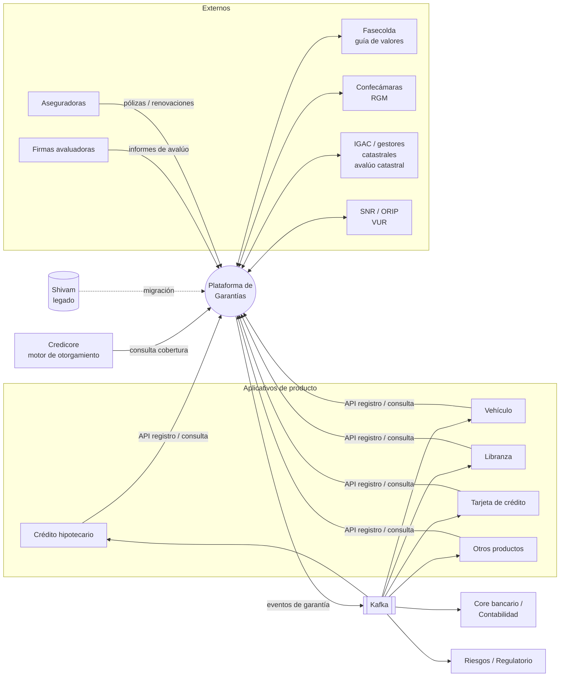
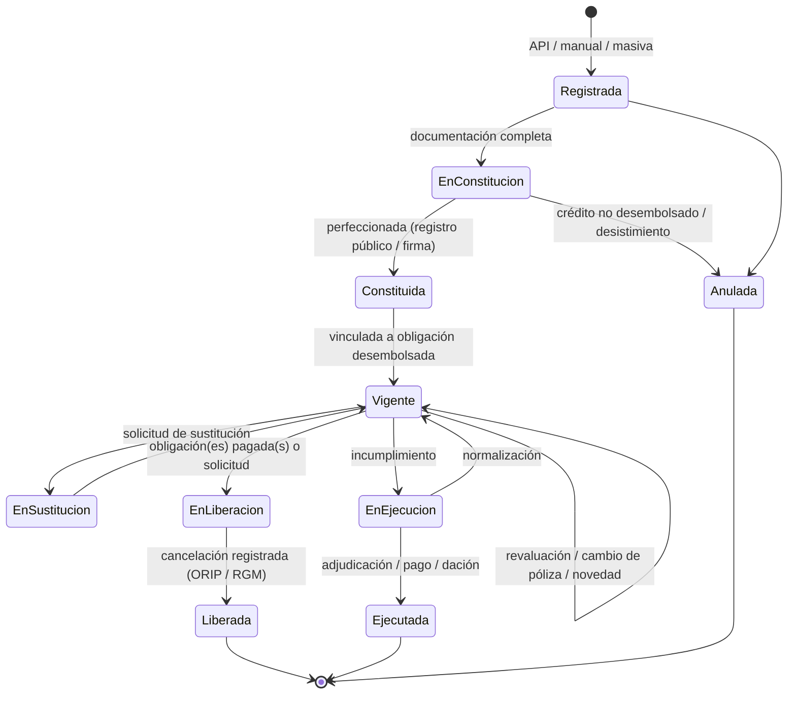
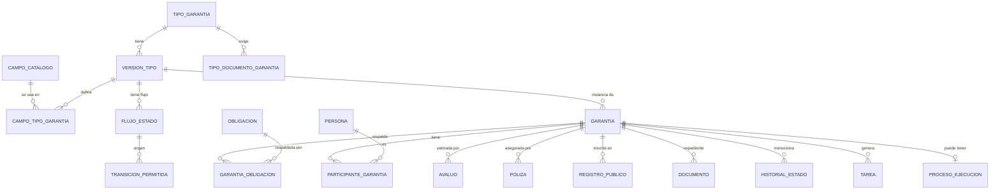

# Especificación funcional y normativa
## Plataforma de Gestión de Garantías — Banco Popular S.A. (Colombia)

| Campo | Valor |
|---|---|
| Versión | 0.2 — Borrador para validación |
| Fecha | 2026-09-25 |
| Estado | En revisión (Negocio, Riesgo de Crédito, Jurídica, Cumplimiento, Arquitectura TI) |
| Alcance de esta versión | MVP + visión de fases posteriores |

> **Cómo leer este documento.** Cada requisito funcional (RF) lleva un identificador, su prioridad (MVP / F2 / F3) y, cuando aplica, la norma que lo origina. Todo lo que no fue confirmado por el negocio aparece marcado como **[SUPUESTO]** y está consolidado en la sección 14 para su validación.

---

## 1. Introducción

### 1.1 Objetivo
Construir una plataforma única, en la nube (Azure), para **registrar, perfeccionar, valorar, monitorear, liberar y ejecutar las garantías que el Banco recibe como respaldo de sus operaciones de crédito**. La plataforma reemplaza el sistema actual del proveedor Shivam y es la fuente oficial de información de garantías para los aplicativos de producto, el motor de otorgamiento (Credicore), Riesgos, Contabilidad y los reportes regulatorios.

### 1.2 Alcance
**Incluido**
- Catálogo **configurable** de tipos de garantía, con campos personalizables por tipo, sin desarrollo adicional.
- Registro de garantías vía **API** (desde los aplicativos de producto), **captura manual** y **carga masiva**.
- Gestión del ciclo de vida completo: constitución, perfeccionamiento, vigencia, revaluación, sustitución, liberación/cancelación y ejecución.
- Vinculación garantía–obligación(es)–terceros (propietarios, garantes).
- Avalúos y revaluaciones (p. ej., vehículos con la Guía de Valores Fasecolda de forma anual).
- Control de pólizas de seguro asociadas a la garantía.
- Integración con registros públicos: Registro de Garantías Mobiliarias (Confecámaras), Superintendencia de Notariado y Registro, y **reporte del avalúo catastral de inmuebles al IGAC / gestor catastral**.
- Expediente documental digital.
- API de consulta de estado y valores para los aplicativos de producto.
- Publicación de eventos de negocio en **Kafka**.
- Reportes de gestión y soporte a reportes regulatorios.
- Migración de datos desde Shivam.

**Excluido**
- Garantías que el Banco **otorga** a terceros (garantías bancarias / stand-by / contingentes).
- Originación y aprobación del crédito (responsabilidad de los aplicativos de producto y Credicore).
- Contabilidad general (la plataforma genera eventos/interfaces; el registro contable ocurre en el core).
- Cálculo de provisiones (la plataforma provee los insumos de garantía; el cálculo es de Riesgos).

### 1.3 Glosario
| Término | Definición |
|---|---|
| Garantía | Bien, derecho o compromiso de un tercero que respalda una o varias obligaciones del deudor con el Banco. |
| Garantía admisible / idónea | Garantía que cumple las condiciones del art. 2.1.2.1.3 del Decreto 2555/2010 (valor suficiente, jurídicamente eficaz, posibilidad real de realización). |
| Garantía abierta | Respalda todas las obligaciones presentes y futuras del deudor, hasta un monto o sin límite. |
| Garantía cerrada | Respalda una obligación específica. |
| Perfeccionamiento | Cumplimiento de las formalidades legales para que la garantía sea oponible (escritura + registro, inscripción en RGM, etc.). |
| Avalúo | Estimación técnica del valor de un bien realizada por un avaluador inscrito en el RAA. |
| Revaluación | Actualización periódica del valor de la garantía (por índice, guía de valores o nuevo avalúo). |
| Cobertura | Relación entre el valor de la garantía asignado a una obligación y el saldo de esa obligación. |
| PDI | Pérdida Dado el Incumplimiento; en los modelos de referencia de la SFC depende del tipo de garantía. |
| RGM | Registro de Garantías Mobiliarias (Ley 1676/2013), administrado por Confecámaras. |
| RAA | Registro Abierto de Avaluadores (Ley 1673/2013). |
| Aplicativo de producto | Sistema que gestiona el flujo de un producto de crédito (hipotecario, vehículo, libranza, tarjeta de crédito, etc.) y que da origen a la garantía. |
| Avalúo catastral | Valor del predio fijado por la autoridad catastral (IGAC o gestor catastral habilitado); distinto del avalúo comercial. |
| NPN | Número Predial Nacional (30 dígitos) que identifica el predio en el catastro. |
| Estado lógico | Identidad estable de un estado del flujo a través de sus versiones (patrón tomado de Proceder). |
| Maker–checker | Doble control: quien registra una operación no puede aprobarla. |

---

## 2. Marco normativo

La tabla relaciona cada norma con los módulos que la implementan. **Jurídica, Riesgos y Cumplimiento deben validar vigencia y alcance antes de aprobar el documento.**

| # | Norma | Qué exige a la plataforma | Módulos |
|---|---|---|---|
| N-01 | **Decreto 2555 de 2010**, art. 2.1.2.1.3 y ss. (garantías admisibles) | Clasificar cada garantía como admisible o no, con criterios parametrizables: valor establecido con base en criterios técnicos y objetivos, eficacia jurídica y posibilidad de realización. | M1, M3, M5 |
| N-02 | **Circular Básica Contable y Financiera (CE 100/1995) — Cap. XXXI (SIAR), Anexo de Riesgo de Crédito, y anexos de modelos de referencia de cartera** | Contar con información de garantías completa, actualizada y trazable; valor de la garantía y su actualización periódica; tipo de garantía como insumo de la PDI; políticas de valoración, seguimiento y realización. | M1, M4, M5, M10, M12 |
| N-03 | **Ley 1676 de 2013** y **Decreto 1835 de 2015** (compilado en el DUR 1074 de 2015) — Garantías mobiliarias | Inscribir en el RGM el formulario de inscripción inicial, modificación, prórroga, cancelación y ejecución; conservar el número de folio electrónico; cancelar la inscripción cuando se extinga la obligación. | M3, M7 |
| N-04 | **Ley 1579 de 2012** (Estatuto de Registro de Instrumentos Públicos) | Para hipotecas: registro de la escritura en la ORIP, seguimiento del certificado de tradición y libertad, matrícula inmobiliaria, anotación de la hipoteca y de su cancelación. | M3, M7 |
| N-05 | **Ley 1673 de 2013** y **Decreto 556 de 2014** (actividad del avaluador); **Resolución IGAC 620 de 2008** (metodologías de avalúo) | Registrar el avaluador con su número RAA vigente; conservar el informe de avalúo; validar la metodología utilizada. | M5 |
| N-06 | **Ley 546 de 1999** (vivienda) y normas de **seguros asociados a créditos hipotecarios y leasing habitacional** (Decreto 2555/2010, Libro 36, Título 2, Cap. 2 — licitación de seguros; Decreto 673/2014) | Controlar la existencia y vigencia de los seguros de incendio y terremoto sobre los inmuebles hipotecados; registrar el Banco como beneficiario oneroso. | M6 |
| N-07 | **Guía de Valores Fasecolda** (referencia de mercado para vehículos) | Revaluación anual del valor comercial de vehículos pignorados o con garantía mobiliaria. | M5 |
| N-08 | **Circular Básica Jurídica (CE 029/2014), Parte I, Título IV, Cap. IV — SARLAFT** | Consultar en listas restrictivas y vinculantes a propietarios y garantes que no sean clientes; conservar la evidencia de la consulta. | M4 |
| N-09 | **CBCF Cap. XXXI (SIAR) — Riesgo operacional** y **CBJ Parte I, Título IV, Cap. V — Ciberseguridad** (antes CE 007/2018) | Trazabilidad, doble control, segregación de funciones, gestión de incidentes, seguridad de la información y continuidad del negocio. | M15, RNF |
| N-10 | **CE 005 de 2019 SFC** (computación en la nube) | Evaluación del proveedor de nube, ubicación y cifrado de los datos, acceso de la SFC a la información, planes de salida y continuidad. Aplica al despliegue en Azure. | RNF, Arquitectura |
| N-11 | **Ley 1581 de 2012** y Decreto 1377 de 2013 (datos personales); **Ley 1266 de 2008** (hábeas data financiero) | Tratamiento de los datos de propietarios y garantes conforme a una finalidad autorizada; minimización de datos; atención de consultas y reclamos. | M4, M15 |
| N-12 | **Ley 1328 de 2009** (protección al consumidor financiero) | Liberación oportuna de garantías y expedición de la documentación de cancelación cuando la obligación se extingue; información clara al consumidor. | M3 |
| N-13 | **Código de Comercio, art. 60** y **Ley 962 de 2005, art. 28** | Conservar libros y papeles del comerciante por **10 años** (base para la política de retención). | M8, M15 |
| N-14 | **Ley 527 de 1999** y **Decreto 2364 de 2012** | Validez de mensajes de datos, documentos electrónicos y firma electrónica en el expediente digital. | M8 |
| N-15 | **Catálogo Único de Información Financiera (CUIF)** — cuentas de orden de bienes y valores recibidos en garantía; **NIIF 9** | Generar la información para el registro contable de las garantías en cuentas de orden y los insumos de pérdida esperada. | M12, M13 |
| N-16 | **Ley 1527 de 2012** (libranza) | Cuando la operación de libranza tenga garantías asociadas (p. ej., pagaré o garantía de un fondo), se identifica el producto de origen. | M1 |
| N-17 | Reglamentos del **Fondo Nacional de Garantías (FNG)** y del **FAG (Finagro)** | Para garantías de fondos: número de certificado, porcentaje de cobertura, vigencia, comisión y proceso de reclamación. | M1, M3 |
| N-18 | **Ley 14 de 1983** (avalúos catastrales), **Ley 1955 de 2019, arts. 79-82** (gestión catastral multipropósito y gestores catastrales) y reglamentación técnica del **IGAC** | Registrar el avalúo catastral de cada inmueble en garantía (NPN, vigencia, gestor catastral) y **reportarlo al IGAC / gestor catastral** en el formato y la periodicidad exigidos. **Jurídica debe confirmar la norma y el formato exacto del reporte (P-01).** | M5, M7 |

---

## 3. Contexto del sistema



**Principio rector:** la solicitud de crédito nace y se gestiona en el aplicativo de producto; en el momento en que el producto define la garantía, **registra** la garantía en esta plataforma vía API. A partir de ahí la plataforma es dueña del ciclo de vida de la garantía y notifica los cambios por Kafka y por API de consulta.

---

## 4. Actores y roles

| Rol | Descripción | Capacidades principales |
|---|---|---|
| **Administrador** | Responsable funcional de la plataforma. | Configurar tipos de garantía y campos, parámetros de valoración, catálogos, reglas de alertas, usuarios y roles; aprobar cargas masivas. No aprueba operaciones que él mismo registró. |
| **Gestor** | Operador del back office de garantías. | Registrar y completar garantías, adjuntar documentos, gestionar perfeccionamiento, registrar avalúos y pólizas, atender alertas, solicitar liberaciones y sustituciones. |
| **Director** | Nivel de aprobación y supervisión. | Aprobar (checker) operaciones sensibles: liberación, sustitución, cambio de valor por encima del umbral, ejecución y cargas masivas; tableros de gestión. |
| **Consultor** | Usuario de solo lectura (comercial, Riesgos, Auditoría, Control Interno). | Consultar garantías, expedientes, historial y reportes según su alcance de datos. |
| **Sistema de producto** | Aplicativo de origen (cliente técnico). | Registrar garantías, actualizar datos en estados permitidos, consultar estado y valores. |
| **Credicore** | Motor de otorgamiento (cliente técnico). | Consultar garantías y cobertura disponible del cliente. |

**[SUPUESTO]** Los roles se asignan desde Microsoft Entra ID (grupos) y pueden restringirse por alcance: regional, oficina, producto o tipo de garantía.

### 4.1 Operaciones que requieren doble control (maker–checker)
| Operación | Maker | Checker |
|---|---|---|
| Liberación / cancelación de garantía | Gestor | Director |
| Sustitución de garantía | Gestor | Director |
| Cambio manual de valor > umbral parametrizable (p. ej., ±10 %) | Gestor | Director |
| Inicio de ejecución | Gestor | Director |
| Carga masiva | Gestor / Administrador | Director / Administrador distinto |
| Publicación de un nuevo tipo de garantía o nueva versión | Administrador | Otro Administrador o Director |

---

## 5. Requisitos funcionales

Prioridad: **MVP** = primera versión productiva; **F2/F3** = fases posteriores.

### M1 — Catálogo configurable de tipos de garantía

> **Referencia:** este módulo reutiliza el modelo del motor de parametrización de la plataforma **Proceder** (`genesis-247/factory-plataforma-proceder-legal`, RF-03, migraciones 0003 y 0009–0012). Allí ya se resolvieron problemas que aquí van a aparecer igual: versionamiento sin afectar lo que está en curso, renombrar sin reescribir registros y catálogos documentales no retroactivos. Las diferencias necesarias para garantías están marcadas como **[Garantías]**.

**Modelo de configuración (heredado de Proceder):**

| Elemento | Proceder | Plataforma de Garantías |
|---|---|---|
| Unidad configurable | Tipo de servicio | Tipo de garantía |
| Catálogo de campos | `campos_catalogo`: campos **reutilizables** entre tipos | Igual |
| Asociación campo–tipo | `campo_tipo_servicio`: obligatoriedad, orden y grupo **por tipo** | Igual; la obligatoriedad además puede depender del estado **[Garantías]** |
| Tipos de dato | texto corto, texto largo, número, fecha, selección única | Los mismos + moneda, booleano, selección múltiple, referencia a catálogo maestro (DIVIPOLA, Fasecolda, aseguradoras…) **[Garantías]** |
| Opciones de listas | Cada opción con `id` estable; se inactiva, nunca se borra | Igual |
| Flujo de estados | Versionado e inmutable; `estado_logico_id` estable; validación de camino a estado final | Igual, pero cada estado configurable se **mapea a un macroestado regulatorio fijo** **[Garantías]** |
| Documentos por tipo | Vigencia temporal (tipo SCD2), no retroactiva | Igual |
| Almacenamiento | Columnas relacionales para campos transversales + JSONB para campos particulares | Igual |

| ID | Requisito | Prioridad | Norma |
|---|---|---|---|
| RF-101 | El Administrador puede **crear, editar, versionar e inactivar tipos de garantía** desde la interfaz, sin despliegue de código. Al inactivar un tipo con garantías vigentes, el sistema muestra una advertencia no bloqueante con el conteo afectado. | MVP | N-01, N-02 |
| RF-102 | Cada tipo tiene **atributos de comportamiento**: clase (real inmueble, mobiliaria, vehículo, fiduciaria, fondo de garantías, personal, depósito/CDT, pignoración de rentas, otra), si es admisible por defecto, si requiere avalúo comercial, si requiere avalúo catastral, método y periodicidad de revaluación, registro público requerido (RGM, ORIP, ninguno), si requiere póliza, porcentaje de admisibilidad, si puede ser abierta o cerrada, y si permite respaldar varias obligaciones. | MVP | N-01, N-02 |
| RF-103 | **Catálogo reutilizable de campos personalizados**: código (inmutable, sin colisión con los campos transversales reservados), etiqueta, tipo de dato, opciones (para listas), validaciones (rango, expresión regular, longitud), ayuda contextual y estado activo/inactivo. | MVP | — |
| RF-104 | **Asociación campo–tipo de garantía**: por cada tipo se define qué campos del catálogo usa, su **obligatoriedad** (por tipo, y opcionalmente por estado: p. ej., "número de escritura" obligatorio solo para pasar a *Constituida*), su orden y su grupo o sección en el formulario. | MVP | — |
| RF-105 | Las opciones de un campo de lista tienen **identificador estable**; la garantía guarda el identificador, no el texto. Renombrar una opción no requiere reescribir garantías; "eliminar" una opción es inactivarla. | MVP | N-09 |
| RF-106 | Los **campos transversales** (id, tipo, versión, estado, valor vigente, fecha de avalúo, moneda, llave natural, aplicativo de origen, fechas de auditoría) son columnas relacionales indexadas y están siempre disponibles; los campos particulares se guardan en JSONB validado contra el esquema de la versión del tipo. | MVP | N-02 |
| RF-107 | **Versionamiento no retroactivo**: modificar campos, obligatoriedad, flujo o documentos de un tipo en uso crea una versión nueva; las garantías existentes conservan la versión con la que se crearon. Un campo obligatorio nuevo no invalida garantías en curso. | MVP | N-09 |
| RF-108 | **Flujo de estados configurable por tipo** (estados y transiciones permitidas), versionado e inmutable, con identidad estable de cada estado a través de las versiones (estado lógico). Si se elimina un estado que tiene garantías, el sistema exige indicar a qué estado se mueven antes de publicar la versión. | MVP | N-09 |
| RF-109 | **Validación del flujo**: el sistema rechaza guardar un flujo en el que algún estado no tenga camino hacia un estado final. Las transiciones de retorno explícitas (p. ej., *Devuelta* → *En revisión*) se permiten. | MVP | — |
| RF-110 | **[Garantías]** Cada estado configurable se **mapea a un macroestado regulatorio fijo** (sección M3). Así los reportes, la cobertura, los eventos Kafka y las integraciones funcionan igual para todos los tipos, aunque cada tipo tenga su propio flujo detallado. | MVP | N-02 |
| RF-111 | **Tipos de documento por tipo de garantía**, cada uno obligatorio u opcional (y opcionalmente, obligatorio a partir de cierto estado), con vigencia temporal: los cambios aplican solo a garantías nuevas. | MVP | N-13 |
| RF-112 | Los campos y documentos configurados se **exponen automáticamente** en la API (JSON Schema por tipo y versión), el formulario web dinámico, la plantilla de carga masiva y los reportes. El formulario se arma en < 3 s. | MVP | — |
| RF-113 | El catálogo inicial precargado incluye como mínimo: hipoteca (vivienda / no vivienda), garantía mobiliaria sobre vehículo, garantía mobiliaria sobre otros bienes (inventarios, maquinaria, derechos económicos), pignoración de CDT/depósitos, FNG, FAG, fiducia en garantía, pignoración de rentas, aval/codeudor y pagaré (no admisible). | MVP | N-01, N-17 |
| RF-114 | Toda la configuración (crear, versionar, publicar) queda en la bitácora de auditoría, y la publicación de una versión requiere doble control (sección 4.1). | MVP | N-09 |
| RF-115 | **Reglas de negocio configurables** por tipo (p. ej., "si el vehículo tiene más de 10 años, requiere avalúo físico"), con un motor de reglas declarativo. | F2 | — |
| RF-116 | Catálogos maestros administrables: departamentos/municipios (DIVIPOLA), tipos de documento de identidad, aseguradoras, firmas avaluadoras, notarías, ORIP, gestores catastrales, líneas y marcas Fasecolda, monedas y productos de origen. | MVP | — |

### M2 — Registro de garantías

| ID | Requisito | Prioridad | Norma |
|---|---|---|---|
| RF-201 | **API de registro** (REST) para los aplicativos de producto: crea la garantía con tipo, campos comunes, campos personalizados, propietarios/garantes, obligaciones vinculadas (número de solicitud u obligación), aplicativo de origen y documentos. | MVP | — |
| RF-202 | La API es **idempotente** (encabezado `Idempotency-Key`) y responde el identificador único de la garantía y su estado. | MVP | N-09 |
| RF-203 | Validación sincrónica contra el esquema del tipo/versión, con errores estructurados por campo. | MVP | — |
| RF-204 | Detección de **duplicados** por llave natural configurable por tipo (p. ej., matrícula inmobiliaria; placa + VIN; número de CDT; certificado FNG). Si el bien ya respalda otra obligación, se vincula (garantía abierta o compartida) en lugar de duplicarse, según las reglas del tipo. | MVP | N-02 |
| RF-205 | **Captura manual** en la interfaz web, con formulario dinámico generado desde el tipo de garantía. | MVP | — |
| RF-206 | **Carga masiva** con un asistente de 4 pasos (patrón de Proceder, RF-17): (1) elegir el tipo de garantía y descargar su plantilla, generada desde la versión vigente; (2) cargar el archivo CSV/XLSX y validar tamaño y estructura; (3) validación previa con reporte de errores por fila (fila, campo, motivo), exportable; las filas que coinciden con una garantía existente se marcan como "actualizará registro existente" y requieren confirmación explícita aparte; (4) confirmación y aprobación maker–checker. El procesamiento es asíncrono y el resultado indica filas cargadas y rechazadas. | MVP | N-09 |
| RF-206a | La carga masiva neutraliza la inyección de fórmulas (celdas que empiezan por `=`, `+`, `-` o `@` se tratan como texto), tiene límites de tamaño, filas, tiempo y memoria, y deja un historial auditable (usuario, fecha, archivo, tipo, filas cargadas y rechazadas). | MVP | N-09 |
| RF-207 | Actualización vía API de los datos de la garantía únicamente en estados que lo permitan (p. ej., antes de *Constituida*); después, los cambios se hacen por novedad controlada. | MVP | N-09 |
| RF-208 | Registro alterno por **consumo de eventos Kafka** publicados por los aplicativos de producto (patrón asíncrono además del REST). | F2 | — |

### M3 — Ciclo de vida y estados



| ID | Requisito | Prioridad | Norma |
|---|---|---|---|
| RF-301 | Los estados del diagrama son los **macroestados regulatorios fijos**. Cada tipo de garantía define su propio flujo detallado (RF-108) y cada estado de ese flujo se mapea a uno de estos macroestados (RF-110). Ejemplo para hipoteca: *Minuta enviada*, *Escritura firmada* y *En registro ORIP* → macroestado *En constitución*. | MVP | N-02 |
| RF-302 | Cada transición registra: usuario o sistema, fecha y hora, motivo, soporte documental y aprobador (cuando aplica maker–checker). | MVP | N-09 |
| RF-303 | **Perfeccionamiento**: checklist por tipo (p. ej., hipoteca: minuta → escritura → boleta fiscal → registro ORIP → certificado de tradición con anotación). La garantía no pasa a *Constituida* sin los ítems obligatorios. | MVP | N-03, N-04 |
| RF-304 | **Liberación**: cuando todas las obligaciones respaldadas están canceladas (evento del core o del producto), se genera automáticamente una tarea de liberación, con un SLA parametrizable, para emitir los documentos de cancelación y, en el caso de mobiliarias, el formulario de cancelación en el RGM. | MVP | N-03, N-12 |
| RF-305 | **Sustitución y liberación parcial** de garantías, con validación de cobertura remanente. | F2 | N-02 |
| RF-306 | **Ejecución**: registro del proceso (judicial, pago directo o ejecución especial — Ley 1676, arts. 58-60), abogado, juzgado, radicado, etapas, costos, valor recuperado y bien recibido en dación o adjudicación. | F2 | N-03 |
| RF-307 | Transiciones automáticas disparadas por eventos externos (desembolso, cancelación de obligación, castigo). | MVP | — |

### M4 — Vinculaciones: obligaciones, propietarios y garantes

| ID | Requisito | Prioridad | Norma |
|---|---|---|---|
| RF-401 | Relación **N:M** garantía–obligación, con valor o porcentaje asignado a cada obligación y control de que la suma asignada no supere el valor admisible de la garantía. | MVP | N-02 |
| RF-402 | Soporte para garantías **abiertas** (respaldan todas las obligaciones del deudor hasta un tope) y **cerradas**. | MVP | N-02 |
| RF-403 | Registro de **propietarios/constituyentes** y **garantes** (persona natural o jurídica, tipo y número de documento, porcentaje de propiedad), distinguiéndolos del deudor. | MVP | — |
| RF-404 | Consulta **SARLAFT** en listas para terceros no clientes, invocando el servicio de listas del Banco y guardando la evidencia de la consulta. | F2 **[SUPUESTO: en el MVP la consulta la hace el aplicativo de producto]** | N-08 |
| RF-405 | Cálculo de **cobertura** por obligación y por cliente: valor de la garantía, valor admisible, valor asignado, saldo (del core) e indicador de cobertura. | MVP | N-02 |
| RF-406 | Tratamiento de datos personales conforme a la finalidad autorizada; enmascaramiento de datos sensibles según el rol. | MVP | N-11 |

### M5 — Valoración, avalúos y revaluación

| ID | Requisito | Prioridad | Norma |
|---|---|---|---|
| RF-501 | Registro de **avalúos**: fecha, tipo (comercial, catastral, guía de valores, índice), valor, moneda, avaluador (nombre, RAA, firma avaluadora), metodología, vigencia e informe adjunto. Se conserva el histórico completo. | MVP | N-05 |
| RF-502 | Cada garantía expone el **valor vigente**, la **fecha del último avalúo**, la **fuente** y la **fecha de la próxima revaluación**. | MVP | N-02 |
| RF-503 | **Revaluación automática de vehículos con Fasecolda**: proceso anual (y bajo demanda) que carga la Guía de Valores (archivo o servicio), cruza por código Fasecolda y modelo, actualiza el valor y deja la traza. Los vehículos sin coincidencia pasan a una bandeja de gestión. | MVP | N-07 |
| RF-504 | **Actualización del valor de inmuebles** por el método parametrizado (índice, p. ej., IVP del DANE o valor catastral, o nuevo avalúo técnico según la periodicidad definida por Riesgos). | F2 **[SUPUESTO]** | N-02, N-05 |
| RF-505 | Cálculo del **valor admisible** = valor vigente × porcentaje de admisibilidad del tipo (parametrizable), con los descuentos por antigüedad del avalúo que defina Riesgos. | MVP | N-01, N-02 |
| RF-506 | Alertas de **avalúo vencido** o próximo a vencer, según la periodicidad de cada tipo. | MVP | N-02 |
| RF-508 | **Avalúo catastral de inmuebles**: por cada inmueble en garantía se registra el Número Predial Nacional, el gestor catastral competente (IGAC o gestor habilitado del municipio), el valor del avalúo catastral, la vigencia (año) y el soporte. Se conserva el histórico por vigencia, separado del avalúo comercial. | MVP | N-18 |
| RF-509 | Actualización anual del avalúo catastral: carga masiva o consulta al gestor catastral al inicio de cada vigencia, con alerta de los inmuebles sin avalúo catastral de la vigencia actual. | MVP / F2 | N-18 |
| RF-507 | Integración con firmas avaluadoras para solicitar avalúos y recibir informes de forma electrónica. | F3 | N-05 |

### M6 — Pólizas de seguro

| ID | Requisito | Prioridad | Norma |
|---|---|---|---|
| RF-601 | Registro de las pólizas asociadas a la garantía: aseguradora, número, ramo (incendio y terremoto, todo riesgo vehículo, otros), valor asegurado, vigencia, beneficiario oneroso y si es colectiva del Banco o endosada. | MVP | N-06 |
| RF-602 | Alertas de vencimiento o no renovación y de valor asegurado inferior al valor de la garantía. | MVP | N-06 |
| RF-603 | Carga masiva o integración con aseguradoras para renovaciones de pólizas colectivas. | F2 | N-06 |

### M7 — Registros públicos y fuentes externas

| ID | Requisito | Prioridad | Norma |
|---|---|---|---|
| RF-701 | **Garantías mobiliarias — RGM (Confecámaras)**: registrar número de folio electrónico, fecha y tipo de formulario (inicial, modificación, prórroga, cancelación, ejecución). En el MVP el registro es manual con soporte adjunto; integración automática en F2. | MVP / F2 | N-03 |
| RF-702 | **Inmuebles — ORIP / SNR**: registrar la matrícula inmobiliaria, el número de escritura, la notaría, la fecha y la anotación; adjuntar el certificado de tradición. Consulta automática de certificados (VUR o servicio disponible) en F2. | MVP / F2 | N-04 |
| RF-703 | **Reporte del avalúo catastral de inmuebles al IGAC / gestor catastral**: generación del reporte (archivo o servicio) de los inmuebles en garantía con NPN, matrícula inmobiliaria, dirección, municipio, avalúo catastral y vigencia, en el formato y la periodicidad que se definan. El formato es configurable. Cada envío queda con su constancia, los rechazos pasan a una bandeja de corrección y se permite reprocesar. En el MVP se genera el archivo y se registra el envío; la transmisión automática va en F2. | MVP / F2 | N-18 |
| RF-704 | Cada integración externa registra la solicitud, la respuesta, los errores y los reintentos (bitácora de interoperabilidad). | MVP | N-09 |

### M8 — Expediente documental

| ID | Requisito | Prioridad | Norma |
|---|---|---|---|
| RF-801 | Expediente digital por garantía, con documentos tipificados (escritura, certificado de tradición, avalúo, póliza, formulario RGM, tarjeta de propiedad, pagaré, etc.) y los obligatorios según el tipo y el estado. | MVP | N-13, N-14 |
| RF-802 | Almacenamiento en Azure Blob Storage con **política de inmutabilidad (WORM)** y retención mínima de 10 años desde la liberación; hash de integridad por documento. | MVP | N-13, N-14 |
| RF-803 | Versionamiento de documentos y visor en línea (PDF / imágenes). | MVP | — |
| RF-804 | Integración con el gestor documental corporativo, si existe. | F2 **[SUPUESTO]** | — |

### M9 — Alertas, tareas y bandejas

| ID | Requisito | Prioridad | Norma |
|---|---|---|---|
| RF-901 | Motor de alertas parametrizable: avalúo vencido, póliza por vencer, perfeccionamiento pendiente > N días, liberación pendiente > SLA, garantía sin cobertura, revaluación con variación > X %. | MVP | N-02, N-06, N-12 |
| RF-902 | Bandeja de trabajo por rol y alcance, con asignación, reasignación, prioridad y SLA. | MVP | — |
| RF-903 | Notificaciones por correo y en la plataforma; publicación de la alerta como evento Kafka. | MVP | — |

### M10 — API de consulta para aplicativos de producto y Credicore

| ID | Requisito | Prioridad | Norma |
|---|---|---|---|
| RF-1001 | Consulta de una garantía por id, por id externo (aplicativo + referencia de solicitud) y por llave natural: estado, subestado, tipo, valor avaluado, **fecha de avalúo**, valor admisible, pólizas vigentes, registros públicos y obligaciones vinculadas. | MVP | — |
| RF-1002 | Consulta de garantías por cliente (deudor o propietario) con cobertura disponible, pensada para Credicore. | MVP | N-02 |
| RF-1003 | Consulta del historial de estados y valores de la garantía. | MVP | N-09 |
| RF-1004 | Webhooks opcionales para aplicativos que no consumen Kafka. | F3 | — |

### M11 — Eventos Kafka

| ID | Requisito | Prioridad |
|---|---|---|
| RF-1101 | La plataforma publica **eventos de dominio** con el patrón *transactional outbox* (garantía de entrega al menos una vez), esquema versionado en un Schema Registry (Avro o JSON Schema) y llave de partición = id de garantía. | MVP |
| RF-1102 | Catálogo mínimo de eventos: `GarantiaRegistrada`, `GarantiaEstadoCambiado`, `GarantiaConstituida`, `GarantiaValorActualizado`, `GarantiaVinculadaObligacion`, `GarantiaDesvinculadaObligacion`, `GarantiaPolizaActualizada`, `GarantiaLiberada`, `GarantiaEnEjecucion`, `GarantiaAlertaGenerada`. | MVP |
| RF-1103 | La plataforma consume eventos del core y de los productos: desembolso, cancelación de obligación, castigo y cambio de saldo (para la cobertura). **[SUPUESTO]** Estos eventos existen o se crearán en Kafka. | MVP |
| RF-1104 | Manejo de errores con reintentos, *dead letter topic* y reprocesamiento desde la interfaz de administración. | MVP |

### M12 — Reportes y tableros

| ID | Requisito | Prioridad | Norma |
|---|---|---|---|
| RF-1201 | Tablero de gestión: garantías por estado, tipo y producto; pendientes de perfeccionar; avalúos y pólizas vencidos; liberaciones fuera de SLA. | MVP | — |
| RF-1202 | Reporte de cobertura por cliente, obligación y portafolio. | MVP | N-02 |
| RF-1203 | Extracción diaria (archivo o evento) de insumos para Riesgos (PDI por tipo de garantía, valor admisible) y Contabilidad (cuentas de orden de garantías recibidas). | MVP | N-02, N-15 |
| RF-1204 | Soporte a los formatos regulatorios de la SFC que incluyan información de garantías (**el listado de formatos debe confirmarlo Regulatorio**). | F2 | N-02 |
| RF-1205 | Exportación a Excel/CSV de cualquier consulta, respetando los permisos del rol. | MVP | — |

### M13 — Integración con core y contabilidad

| ID | Requisito | Prioridad | Norma |
|---|---|---|---|
| RF-1301 | Consumo de saldos de las obligaciones vinculadas (evento o interfaz diaria). | MVP | N-02 |
| RF-1302 | Generación de novedades contables (alta, cambio de valor y baja de garantías en cuentas de orden) hacia el core, mediante un evento o una interfaz. | F2 **[SUPUESTO: en el MVP, reporte diario conciliable]** | N-15 |

### M14 — Migración desde Shivam

| ID | Requisito | Prioridad |
|---|---|---|
| RF-1401 | Inventario y mapeo de los datos de Shivam (garantías, avalúos, pólizas, vinculaciones, documentos e historial) hacia el modelo nuevo, incluidos los campos personalizados. | MVP |
| RF-1402 | Proceso de migración repetible (ETL) con ejecuciones de prueba, reglas de calidad de datos, reporte de rechazos y conciliación de conteos y valores por tipo y estado. | MVP |
| RF-1403 | Migración de documentos con verificación de integridad (hash). | MVP |
| RF-1404 | Estrategia de salida a producción: *big bang* por fecha de corte o convivencia por producto — **ver P-05**. | MVP |
| RF-1405 | Las garantías migradas conservan su identificador de Shivam como referencia externa. | MVP |

### M15 — Seguridad, auditoría y administración

| ID | Requisito | Prioridad | Norma |
|---|---|---|---|
| RF-1501 | Autenticación de usuarios con **Microsoft Entra ID (SSO + MFA)**; autenticación de sistemas con OAuth 2.0 *client credentials* a través de Azure API Management. | MVP | N-09 |
| RF-1502 | Autorización por rol y por alcance de datos (RBAC + atributos). | MVP | N-09 |
| RF-1503 | **Bitácora de auditoría inmutable** de toda consulta de datos personales y de toda modificación (valor anterior / nuevo, usuario, IP, fecha y hora, canal), consultable por Auditoría. | MVP | N-09, N-11 |
| RF-1504 | Segregación de funciones: quien registra no aprueba; el Administrador no opera garantías. | MVP | N-09 |
| RF-1505 | Parametrización con auditoría: umbrales, SLA, porcentajes de admisibilidad, periodicidades y plantillas de notificación. | MVP | N-09 |

---

## 6. Requisitos no funcionales

| ID | Categoría | Requisito |
|---|---|---|
| RNF-01 | Disponibilidad | Servicio **24/7**. Objetivo ≥ 99,9 % mensual para las APIs de registro y consulta. Despliegue en al menos 2 zonas de disponibilidad. |
| RNF-02 | Continuidad **[SUPUESTO]** | RPO ≤ 15 min, RTO ≤ 4 h, con una región secundaria en Azure (par regional) para DR; pruebas de DR al menos una vez al año. |
| RNF-03 | Rendimiento **[SUPUESTO]** | API de consulta: p95 < 300 ms; API de registro: p95 < 800 ms; carga masiva de 100.000 registros en < 1 h. Se ajusta al conocer los volúmenes (P-06). |
| RNF-04 | Escalabilidad | Escalado horizontal automático de los servicios sin estado. |
| RNF-05 | Seguridad | Cifrado en tránsito (TLS 1.2+) y en reposo (llaves administradas por el Banco en Key Vault — CMK); secretos en Key Vault; endpoints privados; WAF; pruebas de seguridad (SAST, DAST, dependencias) en el pipeline; pentest antes de producción. |
| RNF-06 | Nube | Cumplimiento de la CE 005/2019: datos en regiones aprobadas por el Banco, acceso de la SFC, plan de salida y portabilidad (contenedores + base de datos estándar). |
| RNF-07 | Retención | Datos y documentos: 10 años desde la liberación o ejecución (N-13); bitácora de auditoría: 10 años. **Validar con Jurídica (pregunta 21 abierta).** |
| RNF-08 | Observabilidad | Logs estructurados, trazas distribuidas (OpenTelemetry), métricas y alertas en Azure Monitor / Application Insights; correlación de extremo a extremo por `traceId`. |
| RNF-09 | Idioma y accesibilidad | Interfaz en español (Colombia), formatos es-CO (moneda COP, fechas dd/mm/aaaa); accesibilidad WCAG 2.1 AA. |
| RNF-10 | Mantenibilidad | Pruebas automatizadas (unitarias, integración y contrato) con cobertura ≥ 80 % en el dominio; infraestructura como código; CI/CD con ambientes dev / qa / uat / prod. |
| RNF-11 | Interoperabilidad | APIs documentadas en OpenAPI 3.1; eventos documentados en AsyncAPI; versionamiento semántico de contratos. |
| RNF-12 | Zona horaria | Almacenamiento en UTC; presentación en America/Bogota. |

---

## 7. Arquitectura de referencia propuesta (Azure)

> No hay un stack impuesto. La propuesta prioriza tecnologías con amplia oferta de talento en Colombia, soporte de largo plazo y despliegue nativo en Azure. **Requiere aprobación de Arquitectura TI.**

| Capa | Propuesta | Justificación |
|---|---|---|
| Backend | **Java 21 + Spring Boot 3** (monolito modular con límites claros por módulo, preparado para extraer servicios si fuera necesario) | Estándar en la banca colombiana, LTS, ecosistema maduro para Kafka, seguridad y pruebas. Alternativa equivalente: .NET 8. |
| Frontend | **Next.js (React + TypeScript) + Tailwind CSS + shadcn/ui, React Hook Form + Zod, TanStack Query**, con un **renderizador de formularios dinámicos basado en JSON Schema** | Es el mismo stack de front de Proceder: el equipo reutiliza componentes (formulario dinámico, asistente de carga masiva, editor de flujos) y conocimiento. Se despliega como contenedor en Azure, no en Vercel. |
| Base de datos | **Azure Database for PostgreSQL – Flexible Server** (zona redundante); campos personalizados en **JSONB** validados contra JSON Schema, con índices GIN | Es el mismo modelo híbrido de Proceder (PostgreSQL relacional + JSONB), así que el diseño de las tablas de configuración puede portarse casi directo. |
| Mensajería | **Kafka** (el cluster corporativo existente o Azure Event Hubs con protocolo Kafka — ver P-07) + Schema Registry | Requisito explícito del negocio. |
| Cómputo | **Azure Kubernetes Service** o **Azure Container Apps** | Contenedores portables (plan de salida de la CE 005/2019). |
| Exposición de APIs | **Azure API Management** + Application Gateway/WAF | Seguridad, cuotas y catálogo de APIs para los productos. |
| Identidad | **Microsoft Entra ID** | SSO, MFA y grupos para roles. |
| Documentos | **Azure Blob Storage** con inmutabilidad y *legal hold* | Retención regulatoria. |
| Procesos batch | Jobs programados (Spring Batch) para revaluación Fasecolda, cargas masivas y alertas | — |
| Secretos | **Azure Key Vault** | — |
| Observabilidad | Azure Monitor, Application Insights, Log Analytics; SIEM corporativo (p. ej., Sentinel) | — |
| IaC / CI-CD | Terraform o Bicep; Azure DevOps o GitHub Actions | — |

> **Diferencia con Proceder:** Proceder corre en Vercel + Supabase. Esta plataforma debe correr en **Azure** (decisión D-11, CE 005/2019), integrarse con **Kafka** y operar 24/7 con cargas batch (Fasecolda, catastro, migración). Por eso el backend se propone como un servicio independiente (Java/Spring Boot) y no con Server Actions ni Supabase. Las **tablas y reglas** del motor de configuración sí se portan. Si Arquitectura prefiere un backend en TypeScript (NestJS) para compartir más código con Proceder, también es viable (P-17).

### 7.1 Estructura de repositorios
- `garantias-backend`: API, dominio, integraciones, batch y migración.
- `garantias-frontend`: aplicación web SPA.

---

## 8. Modelo de datos conceptual



| Entidad | Atributos clave |
|---|---|
| GARANTIA | id (UUID), tipo + versión, estado, subestado, clase, abierta/cerrada, moneda, valor vigente, valor admisible, fecha del último avalúo, próxima revaluación, llave natural, aplicativo de origen, referencia externa, id Shivam, `atributos` (JSONB), auditoría. |
| GARANTIA_OBLIGACION | id de la obligación en el core, número de solicitud, producto, valor/porcentaje asignado, fechas de vínculo y desvínculo. |
| PARTICIPANTE_GARANTIA | persona, rol (propietario, constituyente, garante, deudor), porcentaje. |
| AVALUO | tipo (comercial, catastral, Fasecolda, índice), fecha, valor, fuente, avaluador y RAA (comercial), NPN, gestor catastral y vigencia (catastral), documento. |
| CAMPO_CATALOGO / CAMPO_TIPO_GARANTIA | Como `campos_catalogo` / `campo_tipo_servicio` de Proceder: código, etiqueta, tipo de dato, opciones con id estable; obligatoriedad (por tipo y estado), orden y grupo. |
| FLUJO_ESTADO / TRANSICION_PERMITIDA | Como `flujo_estados` / `transiciones_permitidas` de Proceder, más `macroestado` (RF-110) y `estado_logico_id`. |
| TIPO_DOCUMENTO_GARANTIA | Vigencia desde/hasta (no retroactiva), obligatorio, estado desde el que es exigible. |
| POLIZA | aseguradora, número, ramo, valor asegurado, vigencia, beneficiario. |
| REGISTRO_PUBLICO | entidad (RGM, ORIP, otra), número (folio / matrícula), tipo de acto, fecha, documento. |

---

## 9. Contratos de integración (borrador)

### 9.1 API REST (prefijo `/api/v1`)
| Método | Recurso | Uso |
|---|---|---|
| `GET` | `/tipos-garantia` y `/tipos-garantia/{codigo}/esquema` | Catálogo y JSON Schema vigente de los campos por tipo. |
| `POST` | `/garantias` | Registrar garantía (idempotente). |
| `PATCH` | `/garantias/{id}` | Actualizar en estados permitidos. |
| `GET` | `/garantias/{id}` | Detalle, estado, valor avaluado, fecha de avalúo, pólizas, registros. |
| `GET` | `/garantias?origen={app}&referencia={ref}` | Búsqueda por referencia del aplicativo de producto. |
| `GET` | `/garantias?documentoCliente=...` | Garantías por cliente (Credicore). |
| `GET` | `/clientes/{doc}/cobertura` | Cobertura consolidada del cliente. |
| `POST` | `/garantias/{id}/obligaciones` | Vincular obligación. |
| `POST` | `/garantias/{id}/avaluos` | Registrar avalúo. |
| `POST` | `/garantias/{id}/documentos` | Adjuntar documento. |
| `GET` | `/garantias/{id}/historial` | Historial de estados y valores. |
| `POST` | `/cargas-masivas` / `GET /cargas-masivas/{id}` | Carga masiva y su resultado. |

**Ejemplo de registro:**
```json
POST /api/v1/garantias
Idempotency-Key: 7f1c...-hipotecario-SOL-2026-000123
{
  "tipo": "VEHICULO_MOBILIARIA",
  "origen": { "aplicativo": "CREDITO_VEHICULO", "referencia": "SOL-2026-000123" },
  "moneda": "COP",
  "valorComercial": 85000000,
  "participantes": [
    { "rol": "PROPIETARIO", "tipoDocumento": "CC", "numeroDocumento": "1020304050", "porcentaje": 100 }
  ],
  "obligaciones": [ { "numeroSolicitud": "SOL-2026-000123", "porcentajeAsignado": 100 } ],
  "atributos": {
    "placa": "ABC123",
    "vin": "9BWZZZ377VT004251",
    "codigoFasecolda": "01601141",
    "modelo": 2024,
    "servicio": "PARTICULAR"
  }
}
```

### 9.2 Eventos (AsyncAPI)
- Tópico propuesto: `bp.garantias.eventos.v1` (un tópico por dominio, tipo de evento en la cabecera), o un tópico por tipo de evento según el estándar corporativo (P-07).
- Sobre CloudEvents: `id`, `type`, `source`, `time`, `subject` (id de garantía), `data`, `dataschema`.

---

## 10. Alcance del MVP

| Incluido en el MVP | Fases posteriores |
|---|---|
| M1 catálogo configurable: campos, flujos y documentos por tipo (modelo Proceder) + catálogo inicial | Motor de reglas avanzado (RF-115) |
| M2 API de registro, captura manual, carga masiva | Registro por evento Kafka (RF-208) |
| M3 ciclo de vida: registro → constitución → vigente → liberación | Sustitución, liberación parcial, ejecución (RF-305/306) |
| M4 vinculaciones N:M, participantes, cobertura | SARLAFT en la plataforma (RF-404) |
| M5 avalúos, valor admisible, revaluación Fasecolda anual, alertas | Actualización de inmuebles por índice, integración con avaluadores |
| M6 pólizas + alertas | Integración con aseguradoras |
| M7 registro manual de RGM / ORIP con soportes; **archivo de reporte del avalúo catastral al IGAC / gestor catastral** | Integraciones automáticas RGM, VUR y transmisión automática al IGAC |
| M8 expediente con retención WORM | Gestor documental corporativo |
| M9 alertas y bandejas | — |
| M10 API de consulta | Webhooks |
| M11 eventos Kafka (publicación y consumo básico) | — |
| M12 tablero y extracciones para Riesgos y Contabilidad | Formatos regulatorios SFC |
| M14 migración Shivam | — |
| M15 seguridad, auditoría, maker–checker | — |

---

## 11. Criterios de aceptación transversales
1. Un Administrador crea un tipo de garantía nuevo con al menos 10 campos personalizados y lo publica; el tipo queda disponible en la API, la UI y la plantilla de carga masiva **sin despliegue de código**.
2. Un aplicativo de producto registra una garantía por API, recibe su id y consulta su estado, valor avaluado y fecha de avalúo.
3. Cada cambio de estado publica el evento correspondiente en Kafka en < 5 s (p95).
4. La revaluación Fasecolda actualiza los vehículos, deja la traza y envía las excepciones a una bandeja.
5. Una liberación exige aprobación de un Director distinto del Gestor que la solicitó.
6. La conciliación de la migración desde Shivam cuadra al 100 % en conteos y ≥ 99,9 % en valores por tipo, con los rechazos documentados.

---

## 12. Riesgos del proyecto
| Riesgo | Mitigación |
|---|---|
| Calidad de datos del legado Shivam | Perfilamiento temprano y ensayos de migración desde el sprint 2. |
| Dependencia de los aplicativos de producto para adoptar la API | Contratos OpenAPI publicados temprano, *sandbox* y mock server. |
| Ambigüedad normativa en periodicidades de revaluación | Parametrización total y validación con Riesgos antes de la F2. |
| Disponibilidad de servicios externos (Fasecolda, RGM, SNR) | Integraciones desacopladas, colas, reintentos y proceso manual de contingencia. |
| Cumplimiento CE 005/2019 en Azure | Involucrar a Seguridad de la Información y Riesgo Operacional desde el diseño. |

---

## 13. Decisiones tomadas (con el negocio)
| # | Decisión |
|---|---|
| D-01 | La plataforma gestiona **garantías recibidas** por el Banco como respaldo de crédito (no garantías otorgadas). |
| D-02 | Jurisdicción: **Colombia**, supervisión de la SFC. |
| D-03 | Los tipos de garantía son **configurables** por el negocio, con campos personalizables. |
| D-04 | El registro inicial llega de los **aplicativos de producto vía API**; también se permite carga masiva. |
| D-05 | Se integra con **Kafka** para eventos. |
| D-06 | Los vehículos se **revalúan anualmente con Fasecolda**. |
| D-07 | Roles: Administrador, Gestor, Director, Consultor. |
| D-08 | Se expone una **API de consulta** de estado, valor avaluado y fecha de avalúo para los aplicativos de producto. |
| D-09 | Credicore es el motor de otorgamiento con el que se integra la plataforma. |
| D-10 | Se **migra** desde el legado Shivam. |
| D-11 | Nube: **Azure**; operación **24/7**; idioma **español**; stack moderno por definir (propuesta en la sección 7). |
| D-12 | Se entrega por **MVP** y fases. |
| D-13 | Se reporta el **avalúo catastral de los inmuebles** al IGAC / gestor catastral (P-01 resuelta). Las mobiliarias se inscriben en el RGM de Confecámaras. |
| D-14 | La configuración de tipos, campos, flujos y documentos sigue el modelo del motor de parametrización de **Proceder** (P-02 resuelta). |
| D-15 | **Tarjeta de crédito** es uno de los aplicativos de producto que registran garantías (P-03 resuelta). |

---

## 14. Preguntas abiertas y supuestos por validar

| # | Pregunta / supuesto | Responsable sugerido |
|---|---|---|
| P-01 | ~~Alcance del reporte al IGAC~~ → **Resuelta (D-13).** Sigue pendiente: norma o requerimiento exacto que origina el reporte, formato (estructura del archivo o servicio), periodicidad y destinatario (IGAC o cada gestor catastral según el municipio). | Jurídica / Negocio |
| P-02 | ~~Capacidades de Proceder~~ → **Resuelta (D-14).** Revisado en el repositorio. Sigue pendiente: confirmar si en garantías hacen falta los tipos de dato adicionales (moneda, booleano, selección múltiple, referencia a catálogo) y la obligatoriedad por estado, que Proceder no tiene. | Negocio |
| P-03 | ~~Significado de "TV"~~ → **Resuelta (D-15): tarjeta de crédito.** Sigue pendiente: la lista completa de aplicativos de producto que se integran en el MVP y qué garantías registra cada uno (p. ej., tarjeta de crédito: ¿CDT pignorado, FNG?). | Negocio |
| P-04 | ¿El cliente o el beneficiario necesitan algún canal propio? (Supuesto: no; la plataforma es interna y se expone a los aplicativos vía API.) | Negocio |
| P-05 | Estrategia de salida desde Shivam: ¿corte único o convivencia por producto? ¿Shivam expone base de datos o solo archivos? ¿Volumen de garantías y documentos? | TI / Negocio |
| P-06 | Volúmenes: garantías vigentes, registros por día, usuarios concurrentes y picos (para dimensionar RNF-03). | Negocio / TI |
| P-07 | Kafka: ¿cluster corporativo existente (Confluent, MSK, Event Hubs)? ¿Estándar de nombres de tópicos, formato (Avro / JSON) y Schema Registry? ¿Existen ya eventos de desembolso y cancelación de obligaciones? | Arquitectura TI |
| P-08 | Core bancario: ¿cuál es y cómo se obtienen los saldos de las obligaciones (evento, API o archivo)? ¿Quién contabiliza las cuentas de orden de garantías? | TI / Contabilidad |
| P-09 | Parámetros de Riesgos: porcentajes de admisibilidad por tipo, periodicidad de avalúo o actualización de inmuebles, índice a usar y descuentos por antigüedad del avalúo. | Riesgo de Crédito |
| P-10 | Retención de la información y de la bitácora de auditoría (supuesto: 10 años). | Jurídica / Cumplimiento |
| P-11 | RPO/RTO y ventanas de mantenimiento permitidas dentro del 24/7. | TI / Continuidad |
| P-12 | ¿La plataforma consulta SARLAFT o lo hace el aplicativo de producto? ¿Qué proveedor de listas usa el Banco? | Cumplimiento |
| P-13 | ¿Existe un gestor documental corporativo y un proveedor de firma electrónica que deban usarse? | TI |
| P-14 | Listado de formatos regulatorios de la SFC que hoy se alimentan con información de garantías desde Shivam. | Regulatorio |
| P-15 | Umbrales de maker–checker (monto o porcentaje de cambio de valor) y SLA de liberación. | Negocio / Riesgo |
| P-16 | Aprobadores formales de este documento. | Dirección del proyecto |
| P-17 | Stack tecnológico: ¿aprueba Arquitectura la propuesta (Java/Spring Boot + Next.js + PostgreSQL en Azure), o prefiere .NET, o un backend en TypeScript (NestJS) para reutilizar más código de Proceder? | Arquitectura TI |
| P-18 | Metodología: ¿se descompone esta especificación en `specs/RF-xx/spec.md` con criterios de aceptación en formato EARS, como en Proceder (lineamientos de la fábrica IngenIA), antes de construir? | Dirección del proyecto |

---

## 15. Control de cambios
| Versión | Fecha | Autor | Cambio |
|---|---|---|---|
| 0.1 | 2026-09-25 | Equipo de proyecto | Versión inicial a partir del levantamiento con el negocio. |
| 0.2 | 2026-09-25 | Equipo de proyecto | Reporte del avalúo catastral al IGAC (N-18, RF-508/509, RF-703); tarjeta de crédito como producto de origen; M1 rediseñado sobre el motor de parametrización de Proceder (campos reutilizables, flujos versionados con macroestados, documentos no retroactivos); carga masiva con el asistente de Proceder; alineación del stack de front. |
